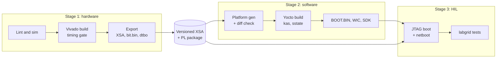

# ZUBoard 1CG MPSoC Project

A hobby project for the Avnet ZUBoard 1CG combining custom programmable-logic (PL) designs with a Yocto-built Linux system on the processing system (PS). The plan is to build it with a free, self-hosted CI pipeline with hardware-in-the-loop (HIL) testing on a dedicated board.

> **Status:** the hardware build (`hw/`) is scripted and runs locally with `make`. The platform, Yocto, HIL and CI parts are designed but not implemented yet; their folders hold `.gitkeep` placeholders and their `make` targets exit with "not implemented yet". See [Open decisions and TODO](#open-decisions-and-todo).

---

## Contents

- [Target hardware](#target-hardware)
- [Current hardware design](#current-hardware-design)
- [Toolchain at a glance](#toolchain-at-a-glance)
- [Repository layout](#repository-layout)
- [Version pinning](#version-pinning)
- [Building locally](#building-locally)
- [CI pipeline](#ci-pipeline)
- [Hardware-in-the-loop testing](#hardware-in-the-loop-testing)
- [Board-specific notes](#board-specific-notes)
- [Open decisions and TODO](#open-decisions-and-todo)
- [References](#references)

---

## Target hardware

| Item | Detail |
|---|---|
| Board | Avnet ZUBoard 1CG (AES-ZUB-1CG-DK-G) |
| Device | AMD Zynq UltraScale+ XCZU1CG-1SBVA484E |
| PS | 2× Cortex-A53, 2× Cortex-R5F, PMU |
| Memory | 1 GB LPDDR4, 32 MB QSPI NOR, microSD |
| Debug | Micro-USB J16 → FT2232H: JTAG + UART0 (MIO10/11) |
| Boot modes (SW2) | JTAG, QSPI32, SD1; eMMC via expansion module |
| Power | USB-C PD, 45 W (15 V / 3 A) |

## Current hardware design

The block design `mpsoc_bd` (`hw/bd/mpsoc_bd.tcl`, generated with Vivado 2026.1 against board part `avnet-tria:zuboard_1cg:part0:1.2`) contains:

| Block | Configuration |
|---|---|
| `zynq_ultra_ps_e_0` | Board-preset PS: LPDDR4 (1 GB, 32-bit), QSPI x4, SD1 (4-bit, card detect on MIO45), GEM2 RGMII + MDIO, USB1 (ULPI), UART0, I2C1, SPI0, GPIO, SWDT0/1, TTC0 |
| PMU I/O | GPI0 on MIO26 (power-button interrupt) and GPO2 on MIO34 (power kill), matching the on/off controller |
| PL clock and reset | `pl_clk0` = 100 MHz; `rst_ps8_0_100M` from `pl_resetn0` |
| PS-PL interface | `M_AXI_HPM1_FPD` (128-bit) → `axi_smc` SmartConnect |
| `axi_iic_0` | AXI IIC at `0xB000_0000` (64 KB) on board interface `tempsensor_i2c_pl` (STTS22H temperature sensor, U1) |

Top level: `hw/rtl/mpsoc_bd_wrapper.v` (with IOBUFs for SCL/SDA). The I2C pin locations come from the board flow, not from the repo's XDC.

### Known issues in the current design

- **The AXI IIC interrupt is not connected.** `iic2intc_irpt` is unconnected and the PS PL-to-PS interrupts (`PSU__USE__IRQ0/1`) are disabled. The Linux `xiic` driver expects an interrupt, so before the Linux side is brought up, enable `pl_ps_irq0` on the PS and connect the interrupt, then re-export the BD with `write_bd_tcl`. This is a PS configuration change, so it also changes the boot image.
- **The user guide disagrees with itself on the sensor pins.** Table 7 lists SCL = A6 and SDA = B7; Table 17 lists the reverse. The board files drive the build, so this only matters if the board flow is dropped. See `hw/constraints/zub1cg_top.xdc`.

## Toolchain at a glance

| Concern | Tool | Open source? |
|---|---|---|
| RTL lint and simulation | Verilator, cocotb (GHDL for VHDL) | Yes |
| Synthesis, implementation, bitstream | AMD Vivado 2026.1 | No, unavoidable for UltraScale+ |
| PL package (`.bit.bin`) | bootgen | Yes |
| Hardware handoff | XSA → SDTGen → Lopper → gen-machine-conf _(planned)_ | Yes |
| Linux distribution | Yocto via AMD EDF / meta-xilinx, pinned with kas _(planned)_ | Yes |
| PL loading at runtime | Linux FPGA Manager + device-tree overlays | Yes |
| CI orchestration | GitLab.com Free + self-hosted GitLab Runner _(deferred)_ | Runner yes; service free tier |
| HIL test framework | labgrid + pytest _(planned)_ | Yes |
| JTAG loading | xsdb (ships with Vivado) | No; OpenOCD is a possible later alternative |

There is no production-ready open-source bitstream flow for UltraScale+. Vivado is treated as a pinned build step, and everything downstream of the XSA is fully open.

---

## Repository layout

```
zub1cg-project/
├── README.md
├── versions.env                   # Pinned tool, board and layer versions
├── Makefile                       # Top-level entry points (make help)
├── .gitignore / .gitattributes
├── hw/                            # Everything Vivado touches
│   ├── Makefile                   # lint | sim | project | bit | xsa | plpkg | wrapper | clean
│   ├── scripts/
│   │   ├── common.tcl             # Shared settings, version guard, helpers
│   │   ├── create_project.tcl     # Throwaway project from committed sources
│   │   ├── build.tcl              # Synth, impl, reports, timing gate, bitstream
│   │   ├── export.tcl             # Fixed XSA including bitstream
│   │   ├── make_wrapper.tcl       # Regenerate the BD wrapper into hw/rtl
│   │   └── mk_plpkg.sh            # bootgen: .bit → .bit.bin
│   ├── bd/mpsoc_bd.tcl            # Block design (write_bd_tcl output)
│   ├── rtl/mpsoc_bd_wrapper.v     # Top level (BD wrapper)
│   ├── constraints/zub1cg_top.xdc # Bitstream settings; non-board-flow pins
│   ├── ip/                        # .gitkeep: standalone IP (.tcl or .xci)
│   └── sim/                       # .gitkeep: cocotb / Verilator testbenches
├── platform/                      # Generated from the XSA, committed (planned)
│   ├── sdt/                       # .gitkeep
│   └── machine/                   # .gitkeep
├── sw/
│   ├── kas/                       # .gitkeep: base.yml, dev.yml, release.yml, hil.yml
│   ├── meta-zub1cg/               # .gitkeep: BSP layer
│   ├── meta-zub1cg-app/           # .gitkeep: product layer (rename freely)
│   └── apps/                      # .gitkeep: application sources
├── tests/hil/                     # .gitkeep: pytest + labgrid tests
├── ci/                            # .gitkeep placeholders; CI is deferred
│   ├── containers/
│   ├── hil/
│   └── pipeline/
└── docs/                          # .gitkeep
```

Generated trees are ignored by git: `build/` (Vivado project, run directories, logs) and `out/` (bitstream, XSA, PL package, reports).

### Layout rules

- **Board files are not vendored.** The Avnet/Tria ZUBoard board files live in the Vivado installation or its board store. `create_project.tcl` fails early with a clear message if the pinned board part is missing. Set `BOARD_REPO_PATH` if they live somewhere else, such as a mounted directory inside a future CI container.
- **The Vivado project is disposable.** `create_project.tcl` deletes and recreates `build/hw/vivado` from `bd/`, `rtl/`, `ip/` and `constraints/` on every run. This uses a scripted project rather than pure non-project mode, because IP Integrator block designs are much better supported in project mode. Nothing in `build/` is ever committed.
- **The block design is committed as Tcl.** After editing the BD in the GUI, run `write_bd_tcl -force hw/bd/mpsoc_bd.tcl` from the throwaway project and commit the diff. Never commit `.bd` files.
- **The wrapper is committed.** `hw/rtl/mpsoc_bd_wrapper.v` is the top level. When BD external ports change, run `make hw-wrapper` to regenerate it and review the diff. Put custom top-level logic in a separate module, because a regenerated wrapper overwrites edits.
- **`platform/` is generated but committed** _(planned)_. CI regenerates it from each new XSA and fails if it differs from the committed copy, so PS-side changes appear as reviewable diffs.
- **The BSP layer and the product layer are separate.** `meta-zub1cg` holds board plumbing (power button and kill handling, Ethernet PHY, USB hub, anything ported from `meta-avnet`). `meta-zub1cg-app` holds everything specific to this project.

---

## Version pinning

All pins live in `versions.env`, which both `make` and `sh` can read:

```sh
VIVADO_VERSION=2026.1
PART=xczu1cg-sbva484-1-e
BOARD_PART=avnet-tria:zuboard_1cg:part0:1.2
EDF_RELEASE=TODO
YOCTO_CODENAME=TODO
KAS_VERSION=TODO
```

The build refuses to run under a different Vivado version, and so does the generated BD script. The EDF / meta-xilinx release must correspond to `VIVADO_VERSION`; it gets filled in when the Yocto side is set up. Tool upgrades happen as a single deliberate commit: bump `versions.env`, upgrade the BD in the new Vivado, re-export `mpsoc_bd.tcl`, and regenerate `platform/`.

Keep comments in `versions.env` on their own lines: `make` would otherwise include the spaces before an inline comment in the value.

---

## Building locally

### Prerequisites

- Vivado 2026.1 on `PATH` (`source <install>/2026.1/Vivado/settings64.sh`); this also provides `bootgen`
- ZUBoard 1CG board files installed for that Vivado version
- Optional: Verilator for `make hw-lint`

### Hardware targets (implemented)

```sh
make help           # list targets
make hw-lint        # Verilator lint of own RTL (skips until hw/rtl has non-wrapper sources)
make hw-sim         # runs hw/sim/Makefile if present, otherwise skips
make hw-project     # recreate build/hw/vivado
make hw-bit         # synth + impl + bitstream; fails on errors or negative WNS/WHS
make hw-xsa         # out/hw/zub1cg-<sha>[-dirty]-vivado2026.1.xsa + system.xsa link
make hw-plpkg       # out/hw/pl/mpsoc_bd_wrapper.bit.bin for the FPGA Manager
make hw-wrapper     # regenerate hw/rtl/mpsoc_bd_wrapper.v after BD port changes
make hw-clean       # remove build/hw and out/hw
```

`hw-xsa` and `hw-plpkg` build everything they depend on. Rebuilds are driven by file timestamps: any change under `hw/bd`, `hw/rtl`, `hw/ip`, `hw/constraints`, `hw/scripts` or `versions.env` recreates the project and reruns the build.

Useful overrides, passed on the command line:

| Variable | Default | Purpose |
|---|---|---|
| `JOBS` | `nproc` | Parallel Vivado jobs |
| `BOARD_REPO_PATH` | empty | Extra board-file repository |
| `ALLOW_TIMING_FAIL` | `0` | Set to `1` to keep a bitstream despite timing failures (local experiments only) |
| `BUILD_DIR`, `OUT_DIR` | `build/hw`, `out/hw` | Relocate build and output trees |

Outputs:

| Path | Content |
|---|---|
| `out/hw/mpsoc_bd_wrapper.bit` | Bitstream |
| `out/hw/<name>.xsa`, `out/hw/system.xsa` | Fixed XSA with bitstream; stable link for downstream tools |
| `out/hw/pl/mpsoc_bd_wrapper.bit.bin` | PL package for runtime loading (overlay `.dtbo` still TODO) |
| `out/hw/reports/` | Timing summary, utilization, DRC, methodology |
| `build/hw/*.log` | Vivado logs per step |

### Software, platform and HIL targets (planned)

```sh
make platform        # XSA → SDT → machine conf into platform/
make platform-check  # regenerate platform/ and fail on diff
make sw-image        # kas build → BOOT.BIN, WIC image
make sw-sdk          # Yocto SDK
make hil             # boot on the HIL board and run tests/hil
```

These currently print "not implemented yet" and exit with an error.

---

## CI pipeline

> **Not set up yet.** This section records the agreed design. No `.gitlab-ci.yml` exists in the repo, and `ci/` holds only placeholders. The CI jobs will call the same `make` targets used locally.

### Platform choice

The pipeline uses **GitLab.com Free, a private repository, and one self-hosted GitLab Runner** on a machine at home.

- **Runner cost.** Self-hosted runners do not consume the Free tier's compute minutes.
- **Storage.** The Free tier has a 10 GiB storage cap. GitLab stores only small artifacts: XSAs, PL packages, reports and logs. WIC images, the Yocto caches and the Vivado container image stay on the runner host.
- **Network.** The runner connects outbound to GitLab, so no inbound ports are opened on the home network.
- **Vivado image.** The Vivado container image is built and kept locally and never pushed to a public registry.
- **Alternatives.** GitHub with a self-hosted runner works for private repos, but check the current self-hosted billing terms. Avoid it on public repos, where fork pull requests could run code on the host. Self-hosted Forgejo is the fallback if everything must stay local.

Pricing and quotas were checked in September 2026 and may change.

### Runner host

| Resource | Guideline |
|---|---|
| CPU | 8+ cores |
| RAM | 32 GB (Vivado for ZU1CG is modest; BitBake parallelism is the main consumer) |
| Disk | 500 GB+ SSD: Vivado install (~100 GB), Yocto downloads and sstate (a few hundred GB) |
| Extra | Second NIC or USB Ethernet dongle for the isolated HIL network; USB port for J16 |

- **Concurrency.** The runner runs one job at a time (`concurrent = 1`), so Vivado and BitBake never compete for RAM.
- **Availability.** The host does not need to be always on; jobs wait until the runner is online.
- **Tags.** The runner registers with tags `vivado`, `yocto` and `zuboard`, so that jobs can move to separate hosts later.

### Pipeline overview



### Stage 1: hardware (tag `vivado`)

1. **Lint and simulate** with open tools first, because this takes minutes while Vivado takes much longer. The stage fails fast on lint errors or testbench failures.
2. **Build with Vivado** in batch mode, using the scripted throwaway project, inside the pinned container. The job fails on any timing violation (negative WNS or WHS), not only on tool errors.
3. **Export the build outputs:**
   - the XSA, named `zub1cg-<git-sha>-vivado<ver>.xsa`
   - the PL package: bitstream converted to `.bit.bin` for FPGA Manager, plus a matching device-tree overlay
   - timing and utilization reports, kept as build records

### Stage 2: software (tag `yocto`)

1. **Generate the platform.** The XSA goes through SDTGen, Lopper and gen-machine-conf into `platform/`, and the job fails if the result differs from the committed copy.
2. **Build with Yocto** via kas inside the builder container, using persistent download and sstate directories on the runner host.
3. **Collect the outputs:**
   - BOOT.BIN (PMUFW, FSBL, TF-A, U-Boot)
   - kernel, device tree and rootfs for netboot
   - WIC SD-card image
   - SDK, built on tags or releases only

### Stage 3: HIL (tag `zuboard`)

This stage boots the new images on the dedicated board and runs `tests/hil`. See [Hardware-in-the-loop testing](#hardware-in-the-loop-testing).

### What rebuilds when

Because the bitstream is loaded at runtime rather than baked into BOOT.BIN, most changes avoid a full rebuild:

| Change | Stage 1 | Stage 2 | Stage 3 |
|---|---|---|---|
| RTL or PL-only block design change | Full | Skipped; last good image reused | Runs with new PL package |
| PS configuration change (MIO, clocks, DDR, AXI ports) | Full | Full, including BOOT.BIN; `platform/` diff must be committed | Runs |
| Kernel, rootfs or app change | Skipped; last released XSA reused | Incremental | Runs |
| Docs only | Skipped | Skipped | Skipped |

On MPSoC, the PS configuration is applied by the FSBL at boot. A PS change made in the Vivado block design therefore always needs a new boot image, and the committed `platform/` diff check is what enforces that.

### Caching and retention

| Data | Location | Retention |
|---|---|---|
| Yocto `DL_DIR` and `SSTATE_DIR` | Runner host, persistent volume | Pruned periodically |
| Vivado and builder container images | Runner host local image store | Rebuilt on `versions.env` change |
| XSA, PL package, reports | GitLab artifacts | Short expiry on branches; kept on tags |
| WIC images, SDKs | Runner host, `/srv/ci-artifacts/<sha>/` | Kept for tags; pruned otherwise |

### CI file sketch (illustrative)

```yaml
# .gitlab-ci.yml (sketch, not final)
stages: [hardware, software, hil]

.hw_changes: &hw_changes
  changes: [hw/**/*, versions.env]

hw-build:
  stage: hardware
  tags: [vivado]
  rules: [*hw_changes]
  script: [make hw-lint hw-sim hw-xsa hw-plpkg]
  artifacts:
    paths: [out/hw/]
    expire_in: 2 weeks

sw-build:
  stage: software
  tags: [yocto]
  needs: [{ job: hw-build, optional: true }]
  rules:
    - changes: [sw/**/*, platform/**/*, hw/**/*, versions.env]
  script: [make platform-check sw-image]

hil:
  stage: hil
  tags: [zuboard]
  resource_group: zuboard        # never two jobs on the board at once
  needs:
    - { job: hw-build, optional: true }
    - { job: sw-build, optional: true }
  script: [make hil]
  artifacts:
    when: always
    paths: [out/hil/]            # console logs, pytest report
```

---

## Hardware-in-the-loop testing

### Bench setup

| Connection | From | To | Purpose |
|---|---|---|---|
| Micro-USB (J16) | Runner host | ZUBoard FT2232H | JTAG (image loading, reset) and UART0 console |
| Ethernet | Runner's second NIC or USB Ethernet | ZUBoard Ethernet | Isolated link for DHCP, TFTP, NFS |
| USB-C power | 45 W PD supply via smart plug _(optional)_ | ZUBoard | Power cycling for hang recovery |

The HIL network is a point-to-point link. The runner serves DHCP, TFTP and NFS only on that interface, which keeps test traffic and a misbehaving board off the home LAN.

### Board configuration

- **Boot mode: JTAG, permanently.** Set SW2 to ON-ON-ON-ON (mode 0x0). Software cannot change the boot mode, and JTAG boot means every run exercises the freshly built FSBL, and therefore the PS configuration. It also avoids flash wear and cannot brick the board. For reference, QSPI32 is ON-OFF-ON-ON and SD1 is OFF-ON-OFF-ON.
- **Power-up strap _(board modification, planned)_.** The on/off controller's INIT input is set by R212/R213. According to the schematic's user note, the default has R213 populated, so after power is applied the board waits for a press of SW7. With R212 populated instead, the board powers up as soon as power is applied. Make that swap on the HIL board so a smart plug can recover it unattended.
- **Reset _(to verify)_.** The schematic routes PS_POR_N and PS_SRST_N from the FT2232H through a level translator, so a board reset may be possible over USB. Several parts on that sheet are DNP, so confirm what is populated. The fallback, a system reset over JTAG from xsdb, always works.

### Boot flow under test

1. Reset the board over JTAG, or power-cycle it if JTAG is unresponsive.
2. Load PMUFW, then FSBL, then TF-A, then U-Boot, all over JTAG with `xsdb` (`ci/hil/jtag-boot.tcl`).
3. U-Boot runs a netboot script. It fetches the kernel and device tree over TFTP and mounts the rootfs over NFS from `/srv/hil/<sha>/`.
4. Copy the PL package into the rootfs `/lib/firmware/` before boot.
5. labgrid waits for the login prompt on UART0, then runs the pytest suite over the serial console or SSH.

Testing the real SD-card boot path (WIC image, SD1 boot mode) needs an SD-card multiplexer and a boot-mode override. It is deferred to a later release-test stage.

### Test suite (`tests/hil/`) _(planned)_

| Test | Checks |
|---|---|
| `test_boot` | Reaches the login prompt within a timeout; no kernel oops or panic in the console log |
| `test_pl_load` | FPGA Manager loads the `.bit.bin` and overlay; state reads `operating` |
| `test_pl_regs` | Reads a known ID or version register from the fabric design over AXI |
| `test_apps` | Project applications start and pass their self-checks |
| `test_shutdown` | A clean shutdown drives the kill signal and the board powers off without filesystem errors |

Console logs and the pytest JUnit report are always uploaded as job artifacts, including on failure.

### Safety and robustness

- **One job at a time.** `resource_group: zuboard` ensures only one job ever touches the board.
- **Timeouts.** Every step has a timeout. On timeout, the job escalates from JTAG reset to power cycle and then fails with logs attached.
- **No secrets on the board.** The board lives on the isolated link and uses a test-only rootfs configuration.

---

## Board-specific notes

- **Power button and shutdown.** A power-button press raises an interrupt to the ZU+ on MIO26. Once the PMU has processed the shutdown, it asserts MIO34_POWER_KILL_N to turn off the regulators. The PMUFW configuration and device tree in `meta-zub1cg` must handle this for clean shutdowns. Port the relevant handling from Avnet's `meta-avnet`.
- **Porting from `meta-avnet`.** Avnet's reference layer targets PetaLinux. Port only what this board needs (power handling, PHY, USB hub, MAC-address EEPROM) into `meta-zub1cg`, not the whole layer.
- **Board files.** The block design uses the board preset (`avnet-tria:zuboard_1cg:part0:1.2`) for PS MIO assignments and LPDDR4 settings, and the board flow for PL interfaces such as the temperature-sensor I2C.
- **PMU power pins already configured.** The PS configuration enables PMU GPI0 on MIO26 and GPO2 on MIO34, which matches the on/off controller wiring.
- **MIO banks.** All three PS MIO banks run at 1.8 V.

---

## Open decisions and TODO

Hardware:

- [ ] Connect the AXI IIC interrupt to the PS (`pl_ps_irq0`) before the Linux bring-up, then re-export `mpsoc_bd.tcl`.
- [ ] First full `make hw-xsa hw-plpkg` run on the build machine; confirm the board flow constrains the sensor I2C pins (check the generated `*_board.xdc` and `out/hw/reports/drc.rpt`).
- [ ] Add the device-tree overlay (`.dtbo`) to the PL package once the SDT flow exists.
- [ ] Add a first own RTL module and testbench so `hw-lint` and `hw-sim` do real work.

Software and platform:

- [ ] Fill in `EDF_RELEASE`, `YOCTO_CODENAME` and `KAS_VERSION` for the release matching Vivado 2026.1.
- [ ] Implement `make platform` / `platform-check` (SDTGen, Lopper, gen-machine-conf).
- [ ] Create `meta-zub1cg`; port the board essentials from `meta-avnet`.
- [ ] Create the kas files and `make sw-image` / `sw-sdk`.

HIL and CI:

- [ ] Confirm runner host specs (OS, cores, RAM, SSD) and whether it is a daily-use desktop or a dedicated machine.
- [ ] Verify whether FT2232H-driven PS_POR/PS_SRST reset is populated on this board revision.
- [ ] Swap R213 → R212 on the HIL board for automatic power-up.
- [ ] Write the xsdb JTAG-boot script, U-Boot netboot script and labgrid environment; first `test_boot`.
- [ ] Set up the Vivado and Yocto containers and the GitLab CI pipeline (deferred).
- [ ] Later: SD mux for real SD-boot release tests; evaluate OpenOCD in place of xsdb.

---

## References

- ZUBoard 1CG Hardware User Guide v1.0 (Avnet), including boot mode, J16 JTAG/UART and on/off controller
- ZUBoard 1CG schematic, AES-ZUB-1CG-DK-G Rev 1
- AMD UG1085: Zynq UltraScale+ Device Technical Reference Manual
- AMD UG1137: Zynq UltraScale+ MPSoC Software Developer Guide (EDF section)
- AMD Embedded Development Framework documentation, including the PetaLinux to EDF migration guide and SHEL flow
- Yocto Project, meta-xilinx, kas
- labgrid documentation
- GitLab CI/CD documentation: compute minutes, self-managed runners, `resource_group`
