# DIFI streaming architecture

Architecture of the VITA 49.2 / DIFI I/Q stream from the ZUBoard 1CG to GNU Radio: data path, packet format, PS-mastered control plane, PL register map, bring-up sequences and design review.

> **Status:** design phase, draft. Nothing here is implemented yet. Register offsets and field layouts are proposals and may change until the first RTL tag; the `VERSION` register major number protects the driver from mismatches after that. DIFI field values follow the v1.2.1 text as published in the Consortium's `DIFI-Certification` repository (see [Standard version](#standard-version)). Items still marked _(verify)_ need hardware or board documentation.

---

## Contents

- [Goals and scope](#goals-and-scope)
- [Standard version](#standard-version)
- [System overview](#system-overview)
- [Data path](#data-path)
- [Packet format](#packet-format)
- [Control plane](#control-plane)
- [PL-driven DMA (v1.0.0)](#pl-driven-dma-v100)
- [Register map](#register-map)
- [Sequences](#sequences)
- [Timebase and timestamps](#timebase-and-timestamps)
- [Loss accounting and error handling](#loss-accounting-and-error-handling)
- [Design review](#design-review)
- [Verification plan](#verification-plan)
- [Proposed code layout](#proposed-code-layout)
- [Future features](#future-features)
- [Open decisions and TODO](#open-decisions-and-todo)
- [References](#references)

---

## Goals and scope

The board produces a stream of HF I/Q samples from a synthetic test source in the PL and sends it to a host PC over Ethernet in a form that open-source SDR software can consume without custom code.

The stream format is **DIFI** (IEEE-ISTO Std 4900-2021, conformance target v1.2.1, see [Standard version](#standard-version)), a published, constrained profile of ANSI/VITA 49.2. DIFI pins down the packet types, prologue fields, timestamp modes and sample format. The reference receiver is GNU Radio with the `gr-difi` out-of-tree module, the only mainstream open-source SDR stack that ingests this format natively.

In scope: the PL signal chain and packetizer, the PS control plane and UDP transport, and the host-side receive chain. Out of scope and not planned: VITA 49.2 command/control packets over the network, transmit, multiple channels, PTP time transfer to the PL timebase, and discovery of the UDP destination. Features planned beyond the baseline are listed under [Future features](#future-features).

---

## Standard version

**Decision.** Conform to **DIFI v1.2.1** (March 2025), Information Class `0x0000` (Basic Data Plane) only: a one-way stream of Standard Flow Signal Data packets (packet class `0x0000`) and Standard Flow Signal Context packets (`0x0001`). No version flow, command, flow-control or link-establishment packets are emitted. Information Class `0x0000` is unchanged in v1.3.0, whose additions all live in new information classes, so this stream is also a valid v1.3.0 Basic Data Plane.

**Sources.** The DIFI Consortium's `DIFI-Certification` repository (pinned at commit `6ee49d1e`) contains condensed references for v1.1, v1.2.1 and v1.3.0 in `.claude/skills/difi/`. This document's field values come from the v1.2.1 reference, cross-checked against the Consortium's Construct packet definitions (`packet_definitions/`) and the three reference captures (`example_pcaps/`). The references are summaries, not the normative text, and the tooling disagrees with them in a few places (see [Oracle caveats](#oracle-caveats)). Each disagreement that affects this design is settled by at least two independent sources, so the official DIFI text is not needed before RTL.

**Deviation: no jumbo frames.** DIFI §2.2 requires every endpoint to support 9000-byte jumbo frames. This design deliberately does not: packets are limited to a 1500-byte MTU (at most 361 samples). Every packet it sends is still valid DIFI, because DIFI allows any Ethernet payload from 128 to 9000 octets; only the endpoint capability is missing. We control both ends of the link, so no sink will need larger packets, and the choice keeps switches, the host NIC and GEM2 out of the requirements. It rules out a formal conformance claim. The project README records this deviation, which is the only one.

**State and Event indicators.** DIFI §4.3.1 expects the context packet's State and Event word to report calibrated-time lock (bit 19) and frequency-reference lock (bit 17), updated about once per second. This design reports both, with their enables (bits 31 and 29) always set. Calibrated-time lock follows the driver's [rate steering](#calibrated-time-lock). Frequency-reference lock is always reported as not locked, because the sample clock comes from the free-running board oscillator. Every context packet, including the periodic one about once per second, carries the current value.

---

## System overview


Solid arrows carry samples and packets; dashed arrows carry control and status. Purple nodes are the data path, coral nodes the control plane, grey nodes the host.

The split of responsibilities is deliberate. The **PL** owns everything that must be exact: sample generation, down-conversion, timestamping, and building complete DIFI packets (headers, prologue, payload, context). The **PS** owns everything that must be flexible: initialization, configuration, policy, and moving finished packets onto the network. The **host** runs stock open-source software.

---

## Data path

### PL

The **test source** generates real 16-bit samples at the input sample rate `FS_IN` (122.88 MHz nominal): two independently configurable NCO tones, whose sum saturates at full scale, or zeros. The input width is a build parameter; a narrower width is left-justified in 16 bits. A deterministic **counter ramp** for bit-exact packetizer tests is injected after the DDC instead, as complex samples at the output rate, paced by the DDC's output valid strobe, so packet timing and the context sample rate are the same as for the other sources.

The **DDC** mixes the selected input to baseband with a tunable, phase-continuous NCO, decimates it with a five-stage CIC (programmable R from 16 to 640) followed by a fixed ÷4 compensating FIR, and outputs complex signed 16-bit I/Q. Total decimation is therefore 64 to 2560 in multiples of 4. The test source's samples are real, and DIFI requires complex samples, so the DDC is needed even for a single tone. The DDC is our own RTL rather than AMD's CIC and FIR compilers: their encrypted models cannot run in the open-source simulators used with cocotb, and our own RTL gives an analytic group delay and a simple bit-true model.

The **DIFI packetizer** accumulates `SAMPLES_PER_PKT` samples, byte-swaps them to big-endian, and prepends the 28-byte DIFI prologue: header, stream ID, class ID, and integer and fractional timestamps. The timestamp is the time the packet's first sample left the signal source (see [Timebase and timestamps](#timebase-and-timestamps)). It also emits context packets according to the [context rules](#context-packet-rules). Both packet types leave through the same AXI4-Stream, so their ordering is preserved end to end.

**AXI DMA** in S2MM scatter-gather mode writes packets through `S_AXI_HPC0` into a DDR ring of 1024 fixed 2 KB slots (2 MB; the largest packet is 1,472 B), one packet per slot, delimited by `TLAST`. The port is used with CCI coherency, so the A53 caches never hold stale ring data; this needs a cacheable `AWCACHE` value on the DMA's write channel and `dma-coherent` in the overlay (exact settings _(verify)_ against UG1085). Ownership of the slots is described under [Driver](#driver). For v1.0.0, the PL commands an AXI DataMover instead; see [PL-driven DMA (v1.0.0)](#pl-driven-dma-v100).

### PS

The **control driver** owns the register bank and the DMA ring. It initializes the pipeline in a defined order, applies configuration through the commit mechanism, services interrupts, and exposes counters. It is described under [Control plane](#control-plane).

The **UDP sender** is a userspace process. It reads completed slots from the ring and sends each packet, unchanged, as one UDP datagram using `sendmmsg`, to a fixed unicast IP address and port read from `/etc/difi-sender.conf` by its systemd unit. It takes each packet's length from its DMA descriptor and counts packets whose length disagrees with the header size field; beyond that check it never parses or modifies packet contents, so the PL stays the single source of truth for the stream.

The **kernel UDP/IP stack**, the `macb` driver on GEM2, and the KSZ9131 PHY put frames on the wire. This is the board's only Ethernet path. The PHY is wired to PS GEM2 over MIO (see `sw/meta-zub1cg/board-dts/zub1cg-board.dtsi`), so the PL cannot transmit frames without the PS.

### Host

`gr-difi`'s DIFI Source block listens on a UDP port, parses data and context packets, outputs a `complex64` stream, and emits stream tags on context changes and on missed packets. Downstream is an ordinary GNU Radio flowgraph: a waterfall, filters, and demodulators. An optional SigMF file sink produces recordings that inspectrum, SDRangel and GNU Radio can open. LNXPC should raise `net.core.rmem_max` and the source block's socket buffer, because the board's ring drains in bursts after scheduling hiccups.

### Throughput

HF bandwidths put little load on this path. At the highest output rate, 1.92 MS/s with 360 samples per packet, the stream is about 5,300 packets/s and about 65 Mbit/s including headers, a small fraction of GEM2's 1 Gbit/s. The first bottleneck at much higher rates would be per-packet cost in the kernel, not link bandwidth.

---

## Packet format

### Encapsulation

| Layer | Header size | Carried by | Built by |
|---|---|---|---|
| Ethernet II | 14 B header + 4 B FCS | wire | GEM2 |
| IPv4 | 20 B | Ethernet payload | kernel |
| UDP | 8 B | IPv4 payload | kernel |
| DIFI / VRT packet | 28 B prologue | UDP payload | **PL packetizer** |
| I/Q samples | none | VRT payload | **PL DDC** |

### DIFI data packet layout

All words are 32-bit, big-endian (network byte order).

```
 word | bits 31 ......................................................... 0
------+----------------------------------------------------------------------
   0  | Header: packet type | C | indicators | TSI | TSF | count | size (words)
   1  | Stream ID
   2  | Class ID: pad bit count (5 b) | reserved (3 b) | OUI (24 b)
   3  | Class ID: information class code (16 b) | packet class code (16 b)
   4  | Integer-seconds timestamp (POSIX)
   5  | Fractional-seconds timestamp, high 32 b (picoseconds)
   6  | Fractional-seconds timestamp, low 32 b
   7  | I0 (16 b, signed) | Q0 (16 b, signed)
   8  | I1                | Q1
  ... | ...
```

Context packets are always 27 words: the same seven-word prologue, carrying the stream ID of the data stream they describe, then CIF0 and 19 words of context fields in a fixed order (see [Context field values](#context-field-values-0x180)). The 4-bit packet count in the header increments per packet, separately for the data and context streams. Receivers use it to detect loss.

### Field values

| Field | Value | Sources |
|---|---|---|
| Class ID word 1 | Pad bit count 0, reserved 0, OUI `0x6A621E` | Spec §4.1; validator; captures |
| Information class | `0x0000` for both packet types | Spec §3.1; validator; captures |
| Packet class | Data `0x0000`, context `0x0001` | Spec Table 4-7; validator; captures |
| Data header bits 31:20 | `0x18E`: type 1, class ID 1, trailer 0, VITA 49.0 0, spectrum/time 0, TSI POSIX, TSF real-time | Spec §4.2; validator; captures |
| Context header bits 31:20 | `0x49E`: type 4, class ID 1, reserved 0, TSM 1 (coarse), TSI POSIX, TSF real-time | Spec §4.3.1, Table 4-16; validator; captures |
| Context size | 27 words (108 B) | Spec; validator; captures |
| CIF0 | `0xFBB98000` when a value changed, `0x7BB98000` otherwise | Spec Figure 9; validator |
| Reference point | 75 (`0x4B`), RF converter analog port | Spec §5.2 |
| Data packet payload format, 16-bit | `0xA00003CF`, `0x00000000` | Spec Figure 10; validator; captures (8-bit form `0xA00001C7`) |
| Reference Level word | Level in bits 15:0 (Q9.7 dBm), Scaling in bits 31:16 = 0 | Spec §4.3.1 and v1.3.0 §1.5 deviation table; Wireshark dissector. The Construct definition disagrees (see [Oracle caveats](#oracle-caveats)). |
| Gain word | `0x00000000` | Spec §4.3.1 (reserved since 1.2.1) |
| State and Event word | `0xA0080000` when calibrated-time locked, `0xA0000000` otherwise: enables 31 (calibrated time) and 29 (reference lock) set, indicator 19 from rate steering, indicator 17 always 0. All other bits 0. | Spec §4.3.1; VITA 49.2 layout (enables in bits 31:20, indicators in 19:8); captures use the same enables (`0xA0020000`) |
| I/Q order | I then Q for each sample; for 16-bit, I in bits 31:16 | Spec §4.2; `certify_source.py` |

**TSI is POSIX, not UTC.** DIFI's UTC code counts leap seconds since 1970; POSIX time does not. The timebase is seeded from the Linux clock, which is POSIX time, so labelling it UTC would be wrong by the leap seconds inserted since 1972 (27 so far). The Consortium's generator, all reference captures and `gr-difi`'s sink use POSIX as well.

**Reference point 75.** The test source is described as entering at the RF converter analog port, with no analog IF. Consequently IF Reference Frequency is 0, IF Band Offset is 0 (zero-IF output), and RF Reference Frequency is the center of the output band. See [Future features](#direct-sampling-hf-adc) for why this reference point was chosen.

**Integer hertz.** DIFI requires bandwidth, sample rate and frequencies in whole hertz: the 20 bits right of the radix point must be 0. The output sample rate `FS_IN_HZ` / `DDC_DECIM` must therefore be an integer for every supported decimation, which constrains the choice of `FS_IN`. At 122.88 MHz (2¹⁶ × 3 × 5⁴ Hz), the main decimations 64, 128, 320, 640, 1280 and 2560 give 1.92 MS/s, 960 kS/s, and 384, 192, 96 and 48 kS/s; the driver refuses any decimation that does not divide `FS_IN_HZ`. DIFI lets a device choose its own sample rates, so no external list constrains them further. RF Reference Frequency is the NCO's actual frequency rounded to the nearest hertz; the NCO's step (`FS_IN` / 2³²) is not an integer, so the reported value can differ by up to 0.5 Hz.

### Context packet rules

- A context packet precedes the first data packet after `ENABLE`, the first data packet after every applied commit, and the first data packet after an overflow. Periodic context packets precede every `CTX_INTERVAL`-th data packet.
- Every context packet carries the timestamp of the data packet that follows it. v1.3.0 states this explicitly for changes: new context values and the first data packet using them share a timestamp, and values never change mid-packet.
- CIF0 bit 31 (change indicator) is set on the first context packet after `ENABLE` and after every applied commit, and clear otherwise.
- The total rate must stay within 0–20 context packets per second, and a context packet is mandatory on every change. The driver sets `CTX_INTERVAL` for about one per second and spaces commits at least 100 ms apart, so that commit-driven packets cannot exceed the limit. Repeated overflow and resume cycles can exceed it; that is treated as a fault condition, counted in `CNT_OVERFLOW_EVENTS`, rather than rate-limited.

### Sizing

| Item | Bytes |
|---|---|
| MTU (IPv4 packet) | 1500 |
| IPv4 + UDP headers | −28 |
| DIFI prologue | −28 |
| Maximum I/Q payload | 1444 → 361 complex int16 samples (`CAPS` maximum) |
| **Chosen payload** | **360 samples = 1440 B** |
| VRT packet size | 1468 B = 367 words (header size field) |

Jumbo frames are not supported (see the deviation note under [Standard version](#standard-version)). The minimum is 18 samples, from DIFI's 128-octet minimum Ethernet payload. 802.1Q VLANs, which DIFI also requires endpoints to support, are handled by the Linux network stack.

With 16-bit samples, each sample is exactly one word, so any sample count is legal; Information Class `0x0000` forbids pad bits, and none are ever needed.

---

## Control plane

The PS is the only bus master for the PL register bank, over AXI4-Lite through an HPM port. Nothing in the PL configures itself, and nothing on the network can write registers.

### Principles

**Context and data never disagree.** VITA 49.2 semantics depend on every data packet being described by the most recent context packet for its stream. If a retune took effect mid-packet, the receiver would attribute samples to the wrong frequency. Every setting that affects the stream is therefore written to a *shadow* register and applied only by an explicit commit, at a packet boundary.

**Commits are atomic, announced and aligned to the signal.** A commit captures the whole shadow set in one clock, which also makes multi-word writes, such as 64-bit frequencies, tear-free without special ordering rules. It then targets the first data packet whose input-side start is still ahead of the pipeline. Settings that act before the DDC (the tone and mixer NCOs) switch at the input sample that becomes that packet's first sample; settings that act after it (`DDC_SHIFT` and the context values) switch when that packet reaches the packetizer. The PL emits a context packet with the change indicator set immediately before it, with the same timestamp, so the timestamp marks when the new settings took effect at the SID location. See [Retune timing](#retune-timing).

**The PL emits context; the PS supplies its values.** The PS writes the context field values in their VITA 49.2 fixed-point formats. The PL inserts them into context packets. A single packet stream carries both packet types, so ordering is guaranteed.

**Structural settings are locked while running.** Settings that change the stream's shape (stream ID, packet size, payload format, timestamp mode, decimation) are *locked*: a commit that changes them while `ENABLE=1` is rejected. Settings that are legitimate runtime changes, such as tuning and tone parameters, may be committed while running.

**Clock-domain crossings go through a fixed set of synchronizers.** Registers live in the AXI clock domain; the datapath and the timebase run in the `FS_IN` clock domain. Every signal that crosses uses one of five named synchronizers:

1. **Commit handshake** (request/acknowledge): shadow set to active set, triggered by `COMMIT`.
2. **Snapshot handshake**: counters and timebase to the **N** registers, triggered by `SNAPSHOT`.
3. **Timebase-load handshake**: `TB_SEED_SEC` and `TB_INC_PS` on `LOAD_NOW`, or `TB_INC_PS` alone on `LOAD_INC`.
4. **Control-pulse synchronizer**: the `ENABLE` level and the `SOFT_RESET`, `FORCE_CONTEXT` and `CLEAR_COUNTERS` pulses.
5. **Event-pulse synchronizers**: datapath events into `STICKY`, and from there to the interrupt.

No other signal crosses; in particular, no datapath logic reads an AXI-domain register directly.

### Driver

Bring-up uses UIO for the register bank plus a `udmabuf` region with single-shot DMA captures, which is enough to bring up the registers and the packetizer from userspace. The kernel driver is required before `test_difi_stream`, which needs a continuous ring, interrupts and the `remove` path. It owns the register bank, the DMA channel through dmaengine, and the interrupt, and exposes a character device: `ioctl` for configuration, `mmap` for the ring and its status page, and `poll` for completions.

**Ring ownership.** The status page holds a producer index, advanced by the driver as DMA completes slots, and a consumer index, advanced by the sender after `sendmmsg` returns. `poll()` wakes the sender when the producer index moves, and the driver re-queues every slot the sender has released. The DMA never writes a slot the sender still owns, so a slow sender fills the ring and stalls the DMA, which shows up as PL FIFO overflow rather than as corrupted packets. The sender records the ring's occupancy high-water mark.

The PL is loaded at runtime by FPGA Manager and can be replaced at runtime. The driver must therefore stop the stream and release the DMA ring in its `remove` path, before the overlay is removed.

The interrupt must be wired to `pl_ps_irq0` in `hw/bd/mpsoc_bd.tcl`, so that Lopper generates `interrupts`/`interrupt-parent` in the overlay. This is the same issue already open for `axi_iic_0`.

---

## PL-driven DMA (v1.0.0)

> **Deviation:** v1.0.0 replaces the scatter-gather AXI DMA and its dmaengine driver with an AXI DataMover that the PL commands itself, as proposed in the [v1.0.0 MVP evaluation](v1-mvp-evaluation.md). The slot ring and its ownership rules from [Driver](#driver) stay. The PL now keeps the producer index, and each slot has one status word in a PL BRAM in place of a dmaengine descriptor. Descriptors report how a slot was filled, never where it is: slot addresses follow from the ring base. The evaluation's open decisions still apply.

### Addressing

All DMA addresses are 32-bit DDR byte addresses. Both block designs build the DataMover with a 32-bit address (`c_addr_width`). Through `S_AXI_HPC0` it reaches `HPC0_DDR_LOW`, `0x0000_0000`–`0x7FFF_FFFF`, so the ring must lie entirely inside that region. There is no upper address word.

### Shared memories

| Memory | A53 address | Size | Holds |
|---|---|---|---|
| CTL BRAM | `0xB001_0000` | 8 KB | Ring configuration and the load handshake |
| DMA BRAM | `0xB001_2000` | 8 KB | One descriptor per slot |

The A53 reaches each BRAM through an AXI BRAM controller. The PL uses the second port, on `pl_clk0`.

### CTL BRAM

| Offset | Name | Written by | Meaning |
|---|---|---|---|
| `0x0` | `CTL_STATUS` | Both | Bit 0 `PL_WRITTEN`, bit 1 `A53_WRITTEN`. Each side sets or clears only its own bit and preserves the other. |
| `0x4` | `BUF_BASE` | A53 | Ring base, a 32-bit DDR byte address, 2 KB aligned |
| `0x8` | `SLOT_COUNT` | A53 | Number of slots N, 1 to 1024 |
| `0xC`–`0x1FFC` | | | Reserved, written as 0 |

`BUF_BASE + 2048 × SLOT_COUNT` must not exceed `0x8000_0000`. The PL does not check these values; out-of-range values are a software error.

**Load handshake.** The PL sets `PL_WRITTEN` once it can accept a configuration:

1. The A53 writes `BUF_BASE` and `SLOT_COUNT`, then waits for `CTL_STATUS` = `0x1`.
2. The A53 sets `A53_WRITTEN`: `0x3`.
3. The PL clears `PL_WRITTEN`, then reads `0x4` and `0x8`: `0x2`.
4. The A53 sees `0x2` and clears `A53_WRITTEN`: `0x0`.
5. The PL sets `PL_WRITTEN` again (`0x1`), sets its producer index to slot 0, and starts streaming.

Software loads the ring once per PL configuration, after zeroing every descriptor. A reload while packets are flowing is undefined in v1.0.0.

### DDR ring

Slot i occupies `BUF_BASE + 2048 × i` to `BUF_BASE + 2048 × i + 2047`. Each slot holds one packet, starting at its first byte. 2 KB holds the largest packet (1,472 B). Because slots are a power of two in size and aligned to it, a packet never crosses a 4 KB boundary, which an AXI burst may not.

### Descriptors

Word i of the DMA BRAM, at offset `4 × i`, describes slot i. A zero word means the PL owns the slot.

| Bits | Field | Meaning |
|---|---|---|
| 31 | `VALID` | 1: the PL has finished the slot, and software owns it |
| 30 | `ERR` | The DataMover's status for the slot was not OKAY; the slot's contents are undefined |
| 29:16 | `SEQ` | Packet sequence number, modulo 2¹⁴ |
| 15:0 | `LENGTH` | Bytes written to the slot |

`SEQ` counts every packet the PL produced, including dropped ones, so a gap between consecutive descriptors is the number of packets dropped because the ring was full. `LENGTH` is in bytes, the same unit as the DataMover's BTT; the UDP sender uses it as the datagram length.

### PL rules

The PL keeps a producer index p, which a load sets to 0 and which advances modulo `SLOT_COUNT`.

1. **Claim.** At the start of each packet, the PL reads descriptor p. If `VALID` is set, or slot p still has a command in flight, the ring is full: the PL drops the whole packet (see [Loss accounting](#loss-accounting-and-error-handling)), advances `SEQ`, and leaves p alone.
2. **Command.** Otherwise it issues one DataMover command for slot p and advances p. TVALID is held until TREADY, and the DataMover must accept the command no later than the packet's first beat.
3. **Stream.** The packet follows on the DataMover's stream input with `TLAST` on its last beat. Its byte count equals the command's BTT.
4. **Complete.** Statuses return in command order. On each one, the PL writes the descriptor of the oldest slot in flight with `VALID` = 1, `ERR` = not OKAY, and that packet's `SEQ` and `LENGTH`. It then pulses `pl_ps_irq1` for one `pl_clk0` cycle.

The DataMover returns a status only after the packet's write responses, so `VALID` = 1 means the packet is already in DDR. Software needs no delay between the interrupt and reading the slot.

**Command**, 80 bits for this DataMover configuration (32-bit address, xCACHE and xUSER enabled; PG022):

| Bits | Field | Value |
|---|---|---|
| 79:76 | xCACHE | See [Coherency](#coherency) |
| 75:72 | xUSER | 0 |
| 71:68 | RSVD | 0 |
| 67:64 | TAG | p[3:0], to cross-check the status |
| 63:32 | SADDR | `BUF_BASE + 2048 × p` |
| 31 | DRR | 0 (no DRE) |
| 30 | EOF | 1 |
| 29:24 | DSA | 0 |
| 23 | TYPE | 1 (INCR) |
| 22:0 | BTT | Packet length in bytes; the DataMover uses bits 15:0 |

**Status**, 8 bits: bit 7 OKAY, bit 6 SLVERR, bit 5 DECERR, bit 4 INTERR, bits 3:0 TAG.

### Software rules

1. Reserve the ring in low DDR (a `reserved-memory` node), and map it as [Coherency](#coherency) requires.
2. Zero descriptors 0 to N − 1, then load the ring through the handshake.
3. Keep a consumer index c, starting at 0. After loading and on every interrupt, while descriptor c has `VALID` set:
   - if `ERR` is set, count the error;
   - otherwise send `LENGTH` bytes from slot c as one datagram;
   - then write 0 to descriptor c and advance c modulo N.
4. Treat the interrupt only as a wake-up. One interrupt may cover several slots, so software never infers slots from a count of interrupts.
5. Check `SEQ` continuity, and count gaps as dropped packets.

### Coherency

The xCACHE value, and with it the DataMover's `AWCACHE`, is open. One choice is `0011` (normal, non-cacheable, bufferable) with an uncached mapping, as the [evaluation](v1-mvp-evaluation.md#recommendations) recommends. The other is a cacheable value with CCI coherency through HPC0 and `dma-coherent` in the overlay, as under [Data path](#pl). The PL and the overlay must agree.

---

## Register map

One AXI4-Lite slave, 4 KB aperture. The base address is assigned in the block design and appears in the generated PL overlay. All registers are 32-bit and word-aligned; reserved bits read as 0 and must be written as 0; unmapped offsets read as 0 and ignore writes.

### Conventions

| Access | Meaning |
|---|---|
| RO | Read-only |
| RW | Read/write |
| W1C | Read; writing 1 to a bit clears it |
| SC | Write 1 to trigger; self-clearing, reads as 0 |

| Flag | Meaning |
|---|---|
| **S** | Shadowed: the write lands in the shadow set and takes effect on the next `COMMIT`. Reads return the shadow value. |
| **L** | Locked: a commit that changes this register while `CTRL.ENABLE=1` is rejected with error `0x03` |
| **N** | Read value comes from the last `SNAP_CTRL.SNAPSHOT` |

64-bit quantities are split `_HI` (bits 63:32) / `_LO` (bits 31:0). They are either shadowed, so the commit makes them atomic, or snapshotted, so readback is coherent.

**RSVD (growth)** marks a bit or field encoding already claimed by a planned feature; [Future features](#future-features) lists each claim. Growth bits and registers are not implemented in this build: they read as 0 and writes to them are ignored, and software writes 0 to them. A growth encoding of a commit-checked field is rejected with the error code given in that field's description. Growth allocations are not reassigned to anything else.

### Block summary

| Offset | Block |
|---|---|
| `0x000`–`0x01F` | Identification and capabilities |
| `0x020`–`0x03F` | Control and commit |
| `0x040`–`0x0FF` | Status, interrupts, counters |
| `0x100`–`0x13F` | Stream configuration |
| `0x140`–`0x17F` | Signal chain |
| `0x180`–`0x1FF` | Context field values |
| `0x200`–`0x23F` | Timebase |
| `0x240`–`0xFFF` | Reserved |

### Identification and capabilities (`0x000`)

| Offset | Name | Access | Bits | Reset | Description |
|---|---|---|---|---|---|
| `0x000` | `ID` | RO | 31:0 | `0x4449_4649` | ASCII `"DIFI"`. The first read after overlay load; HIL `test_pl_regs` checks it. |
| `0x004` | `VERSION` | RO | 31:24 major, 23:16 minor, 15:0 patch | build | Register map version. The major number changes on any incompatible change; the driver refuses unknown majors. |
| `0x008` | `BUILD_SHA` | RO | 31:0 | build | First 32 bits of the git SHA used for the bitstream (`GIT_SHA` in `hw/Makefile`); ties the running PL to its `<stem>`. |
| `0x00C` | `CAPS` | RO | 0 test source, 1 RSVD (growth), 2 RSVD (growth), 3 decimation power-of-two only (0 in this build), 15:8 sample bits, 31:16 max samples per packet | build | Build-time features the driver must check before configuring. Max samples per packet is 361 (1500-byte MTU; see [Sizing](#sizing)). |
| `0x010` | `DECIM_RANGE` | RO | 15:0 min, 31:16 max | build | Legal `DDC_DECIM` range; 64 to 2560 in this build. |
| `0x014` | `FS_IN_HZ` | RO | 31:0 | build | Nominal input sample rate in Hz; 122,880,000 in this build. The driver derives output rate, NCO increments and timebase increment from it. |
| `0x018` | `SCRATCH` | RW | 31:0 | `0` | Bus sanity check; no effect. |
| `0x01C` | `DIFI_SPEC` | RO | 31:24 major, 23:16 minor, 15:8 patch | `0x0102_0100` | DIFI revision this build conforms to (1.2.1; see [Standard version](#standard-version)). The driver logs it and refuses revisions it does not know. |

### Control and commit (`0x020`)

| Offset | Name | Access | Bits | Reset | Description |
|---|---|---|---|---|---|
| `0x020` | `CTRL` | RW | 0 `ENABLE`, 1 `SOFT_RESET` (SC) | `0` | `ENABLE` 0→1 starts the stream; the first packet out is always a context packet. 1→0 finishes the current packet, then stops. `SOFT_RESET` clears datapath, FIFOs and packet counts, but keeps register values. |
| `0x024` | `COMMIT` | SC | 0 `COMMIT`, 1 `FORCE_CONTEXT` | `0` | `COMMIT` applies the shadow set at the next packet boundary (immediately when disabled). `FORCE_CONTEXT` emits an extra context packet without changing settings. |
| `0x028` | `COMMIT_STATUS` | RO | 0 `PENDING`, 1 `ERROR`, 15:8 `ERROR_CODE`, 31:16 `SEQ` | `0` | `PENDING` stays set until the commit is applied or rejected. `SEQ` increments on every applied commit. |

Commit error codes:

| Code | Meaning |
|---|---|
| `0x00` | None |
| `0x01` | `SAMPLES_PER_PKT` is below 18 or above the `CAPS` maximum |
| `0x02` | `DDC_DECIM` is not a multiple of 4 within `DECIM_RANGE`, or not a power of two when `CAPS[3]` is set |
| `0x03` | A locked (**L**) register changed while `ENABLE=1` |
| `0x04` | `PAYLOAD_FORMAT` is not supported by this build |
| `0x05` | `SRC_SEL` selects a source this build does not have |
| `0x06` | `TSI_SEL` is not 3 (POSIX): 0 is not allowed in DIFI, 1 (UTC) is not supported, 2 is RSVD (growth) |
| `0x07` | `CTX_REF_POINT_ID` is not 100, 75, 25 or 15 |
| `0x08` | `DDC_PHASE_INC` has bit 31 set: a tuning at or above `FS_IN_HZ` / 2, or negative, would select the mirror image, which is spectrally inverted |

A rejected commit leaves the active set unchanged and sets `STICKY.COMMIT_REJECTED`.

### Status, interrupts, counters (`0x040`)

| Offset | Name | Access | Bits | Reset | Description |
|---|---|---|---|---|---|
| `0x040` | `STATUS` | RO | 0 `RUNNING`, 1 `TIMEBASE_VALID`, 2 RSVD (growth) | `0` | Live state. `TIMEBASE_VALID` is set after the first seed load. |
| `0x044` | `STICKY` | W1C | 0 `FIFO_OVERFLOW`, 1 `COMMIT_REJECTED`, 2 RSVD (growth), 3 `TIMEBASE_STEP`, 4 `DDC_CLIP`, 5 `COMMIT_DONE` | `0` | Latched events. `TIMEBASE_STEP` marks a seed loaded while running. `DDC_CLIP` marks saturation at the DDC output. |
| `0x048` | `IRQ_ENABLE` | RW | same bits as `STICKY` | `0` | IRQ output = OR of (`STICKY` AND `IRQ_ENABLE`). Level-sensitive, to `pl_ps_irq0`. |
| `0x050` | `SNAP_CTRL` | SC | 0 `SNAPSHOT`, 1 `CLEAR_COUNTERS` | `0` | `SNAPSHOT` latches all **N** registers coherently across clock domains. `CLEAR_COUNTERS` zeroes the counters and the FIFO high-water mark. |
| `0x054` | `CNT_DATA_PKTS` | RO N | 31:0 | `0` | Data packets emitted (wraps). |
| `0x058` | `CNT_CTX_PKTS` | RO N | 31:0 | `0` | Context packets emitted (wraps). |
| `0x05C` | `CNT_DROPPED_SAMPLES` | RO N | 31:0 | `0` | Samples lost to FIFO overflow. |
| `0x060` | `CNT_OVERFLOW_EVENTS` | RO N | 31:0 | `0` | Distinct overflow events. |
| `0x064` | `CNT_CLIP_EVENTS` | RO N | 31:0 | `0` | DDC saturation events. |
| `0x068` | `FIFO_HIGH_WATER` | RO N | 15:0 | `0` | Deepest FIFO fill seen, in 32-bit words. Used to size the FIFO from measurements rather than guesses. |

### Stream configuration (`0x100`)

| Offset | Name | Access | Bits | Reset | Description |
|---|---|---|---|---|---|
| `0x100` | `STREAM_ID` | RW S L | 31:0 | `0` | Stream ID for data packets and their context packets. DIFI's default is 0. |
| `0x104` | `CLASS_OUI` | RO | 23:0 | `0x6A621E` | DIFI OUI. Build constant. |
| `0x108` | `CLASS_INFO_CODE` | RO | 15:0 | `0x0000` | Information class code (Basic Data Plane). Build constant. |
| `0x10C` | `CLASS_DATA_CODE` | RO | 15:0 | `0x0000` | Packet class code for data packets. Build constant. |
| `0x110` | `CLASS_CTX_CODE` | RO | 15:0 | `0x0001` | Packet class code for context packets. Build constant. |
| `0x114` | `SAMPLES_PER_PKT` | RW S L | 15:0 | `360` | Complex samples per data packet, 18 to the `CAPS` maximum; see [Sizing](#sizing). |
| `0x118` | `CTX_INTERVAL` | RW S | 23:0 | `0` | Data packets between periodic context packets; 0 = only on start, commit and overflow recovery. The driver sets it for about one context packet per second; DIFI allows at most 20 per second in total. |
| `0x11C` | `PAYLOAD_FORMAT` | RW S L | 4:0 item bits − 1 | `15` | Sample width. This build accepts only 16-bit. The other format fields (complex Cartesian, signed fixed-point) are fixed by DIFI; the PL builds the context packet's payload format field from them. |
| `0x120` | `TSI_SEL` | RW S L | 1:0 | `3` | Integer-seconds timestamp type: 3 = POSIX; 2 = RSVD (growth); 0 and 1 are rejected with `0x06`. Must match how the timebase was seeded; see [Field values](#field-values). |

### Signal chain (`0x140`)

| Offset | Name | Access | Bits | Reset | Description |
|---|---|---|---|---|---|
| `0x140` | `SRC_SEL` | RW S L | 1:0 | `1` | 0 = RSVD (growth), rejected with `0x05`; 1 = test tones; 2 = counter ramp, injected after the DDC at the output rate (I = n mod 2¹⁶, Q = ¬I, for bit-exact tests; n counts output sample periods from `ENABLE` or `SOFT_RESET` and keeps counting through dropped packets, so each gap in the ramp equals the samples counted in `CNT_DROPPED_SAMPLES`); 3 = zeros. |
| `0x144` | `TONE0_PHASE_INC` | RW S | 31:0 | `0` | Tone 0 frequency: f = inc × `FS_IN_HZ` / 2³². |
| `0x148` | `TONE0_AMPL` | RW S | 15:0 Q1.15 | `0x2000` | Tone 0 amplitude (about −12 dBFS). |
| `0x14C` | `TONE1_PHASE_INC` | RW S | 31:0 | `0` | Tone 1 frequency. |
| `0x150` | `TONE1_AMPL` | RW S | 15:0 Q1.15 | `0` | Tone 1 amplitude (off). |
| `0x160` | `DDC_PHASE_INC` | RW S | 31:0, bit 31 must be 0 | `0` | Mixer NCO: tunes to f = inc × `FS_IN_HZ` / 2³², so 0 ≤ f < `FS_IN_HZ` / 2. A commit with bit 31 set is rejected with `0x08`, so the output spectrum is never inverted; the driver also keeps the whole band, f ± bandwidth / 2, inside that range. Phase-continuous; retune by committing while running (see [Retune timing](#retune-timing)). The driver updates `CTX_RF_REF_FREQ` in the same commit. |
| `0x164` | `DDC_DECIM` | RW S L | 15:0 | build | Total decimation: CIC R × 4, a multiple of 4 within `DECIM_RANGE`. Output rate = `FS_IN_HZ` / `DDC_DECIM`; the driver refuses a value that does not divide `FS_IN_HZ`. |
| `0x168` | `DDC_SHIFT` | RW S | 5:0 | build | Right-shift after the filter chain to compensate CIC gain (R⁵, up to about 47 bits of growth); tune using `DDC_CLIP`. It changes the DDC gain, so the driver updates `CTX_REF_LEVEL` in the same commit. |

### Context field values (`0x180`)

These registers are copied verbatim into context packets. The driver computes them in VITA 49.2 formats; the PL does no arithmetic on them. The field set and order are fixed by DIFI (27-word Standard Flow Signal Context); the PL emits them in register order, with the Gain word as 0.

| Offset | Name | Access | Format | Description |
|---|---|---|---|---|
| `0x180` | `CTX_REF_POINT_ID` | RW S | 32-bit | Reference point: 100, 75, 25 or 15; reset 75 (RF converter analog port). |
| `0x184`/`0x188` | `CTX_BANDWIDTH_HI/_LO` | RW S | Q44.20 Hz, integer | Usable bandwidth after the decimation filters. |
| `0x18C`/`0x190` | `CTX_IF_REF_FREQ_HI/_LO` | RW S | Q44.20 Hz, integer | IF reference frequency; 0, because there is no analog IF. |
| `0x194`/`0x198` | `CTX_RF_REF_FREQ_HI/_LO` | RW S | Q44.20 Hz, integer | Center of the output band at the reference point; the NCO's actual frequency rounded to the nearest hertz. Follows `DDC_PHASE_INC`. |
| `0x19C`/`0x1A0` | `CTX_IF_BAND_OFFSET_HI/_LO` | RW S | Q44.20 Hz, integer | IF band offset; 0 for zero-IF output. |
| `0x1A4` | `CTX_REF_LEVEL` | RW S | 15:0 Q9.7 dBm | Power at the reference point of a sine wave that produces a full-scale sine in the payload. For the test source, input full scale is defined as 0 dBm, so the value is 0 dBm minus the DDC gain in dB. That gain includes the residual CIC gain R⁵ / 2^`DDC_SHIFT`, which is not a power of two for most decimations and can be up to about 6 dB below unity. Follows `DDC_DECIM` and `DDC_SHIFT`. The PL emits the Scaling sub-field (bits 31:16, transmit only) as 0. |
| `0x1A8` | — | — | — | Reserved. The Gain word is reserved in v1.2.1; the PL always emits 0. |
| `0x1AC`/`0x1B0` | `CTX_SAMPLE_RATE_HI/_LO` | RW S | Q44.20 Hz, integer | Output sample rate; must equal `FS_IN_HZ` / `DDC_DECIM` exactly. |
| `0x1B4`/`0x1B8` | `CTX_TS_ADJUST_HI/_LO` | RW S | 64-bit signed, fs | Delay from the reference point to the SID location; 0 for the test source. Not the DDC delay (see [Timebase](#timebase-and-timestamps)). |
| `0x1BC` | `CTX_TS_CAL_TIME` | RW S | 32-bit, s | Last time the timestamp was known correct: integer seconds (in the `TSI_SEL` epoch) of the last seed. |
| `0x1C0` | `CTX_STATE_EVENT` | RW S | 32-bit | State and Event word, copied verbatim; reset `0xA0000000` (enables set, not locked). The driver sets bit 19 while [calibrated-time lock](#calibrated-time-lock) holds and commits each change, so the announcing context packet has the change indicator set. |
| `0x1C4` | `CTX_CIF0` | RO | 32-bit | `0x7BB98000`, the field set this build emits. The PL sets bit 31 on context packets that announce a change. |

Context values are supplied by software rather than derived in the PL, which keeps the PL free of division and logarithms. The driver keeps them consistent with the signal chain by updating them in the same commit: `CTX_SAMPLE_RATE` and `CTX_BANDWIDTH` follow `DDC_DECIM`; `CTX_RF_REF_FREQ` follows `DDC_PHASE_INC`; `CTX_REF_LEVEL` follows `DDC_DECIM` and `DDC_SHIFT`; `CTX_STATE_EVENT` follows the rate steering's lock state; and, outside this block, `TS_PIPE_DELAY_PS` follows `DDC_DECIM` and `SRC_SEL`. The reference checker verifies every context field against the values derived from the committed registers.

### Timebase (`0x200`)

| Offset | Name | Access | Bits | Reset | Description |
|---|---|---|---|---|---|
| `0x200` | `TB_CTRL` | RW | 0 `LOAD_NOW` (SC), 3:1 RSVD (growth), 4 `LOAD_INC` (SC) | `0` | `LOAD_NOW` loads the seed and the increment immediately. `LOAD_INC` loads only the increment, without disturbing the count, for [rate steering](#rate-steering). Both go through the timebase-load handshake. |
| `0x204` | `TB_SEED_SEC` | RW | 31:0 | `0` | Integer seconds to load, in the `TSI_SEL` epoch; fractional part resets to 0 on load. |
| `0x208` | `TB_INC_PS_INT` | RW | 31:0 | build | Picoseconds per `FS_IN` clock, integer part. Takes effect only on `LOAD_NOW` or `LOAD_INC`. |
| `0x20C` | `TB_INC_PS_FRAC` | RW | 31:0 | build | Fractional part, in units of 2⁻³² ps. |
| `0x210` | `TB_NOW_SEC` | RO N | 31:0 | `0` | Current integer seconds. |
| `0x214`/`0x218` | `TB_NOW_PS_HI/_LO` | RO N | 63:0 | `0` | Current fractional seconds, in picoseconds. |
| `0x21C` | — | — | — | — | RSVD (growth). |
| `0x220`/`0x224` | `TS_PIPE_DELAY_PS_HI/_LO` | RW S L | 63:0 | build | Delay from the SID location to the packetizer, in picoseconds (the DDC group delay plus pipeline latency for the committed decimation). Subtracted from every latched timestamp. 0 when `SRC_SEL` selects the counter ramp, which bypasses the DDC. |

---

## Sequences

### Initialization

1. **Load the PL.** FPGA Manager applies the overlay (`<stem>.bit.bin` + `<stem>.dtbo`); the register bank, DMA and interrupt nodes appear, and the driver probes.
2. **Identify.** Read `ID`, `VERSION`, `BUILD_SHA`, `CAPS`, `DECIM_RANGE`, `FS_IN_HZ`, `DIFI_SPEC`. Abort on a wrong `ID` or unknown `VERSION` major. Write and read back `SCRATCH`.
3. **Quiesce.** Write `CTRL.SOFT_RESET`, confirm `STATUS.RUNNING=0`, write 1s to clear `STICKY`, write `SNAP_CTRL.CLEAR_COUNTERS`.
4. **Seed the timebase.** Write `TB_INC_PS_INT/FRAC` (10¹² / `FS_IN_HZ`) and `TB_SEED_SEC` (POSIX seconds from the Linux clock). Then write `TB_CTRL.LOAD_NOW` just after a second boundary of the system clock, and confirm `STATUS.TIMEBASE_VALID`. From then on the driver steers the rate (see [Rate steering](#rate-steering)).
5. **Configure.** Write all stream, signal chain and context registers (shadow set). Derive `CTX_SAMPLE_RATE`, `CTX_BANDWIDTH`, `CTX_RF_REF_FREQ` and `CTX_REF_LEVEL` from the same inputs used for `DDC_DECIM`, `DDC_SHIFT` and `DDC_PHASE_INC`. Refuse a decimation that does not divide `FS_IN_HZ`, and keep the tuning between 0 and `FS_IN_HZ` / 2. Write `CTX_STATE_EVENT` as `0xA0000000`: rate steering has not locked yet. Write `TS_PIPE_DELAY_PS` for the decimation (0 for the counter ramp), and `CTX_TS_CAL_TIME` from the seed in step 4.
6. **Commit.** Write `COMMIT.COMMIT`, wait for `COMMIT_STATUS.PENDING=0`, check `ERROR=0`. While disabled, the commit applies immediately.
7. **Arm the DMA ring.** Queue all slots to the S2MM channel before the source can produce data.
8. **Enable interrupts.** Set `IRQ_ENABLE` for at least `FIFO_OVERFLOW`, `COMMIT_REJECTED` and `COMMIT_DONE`.
9. **Start.** Start the UDP sender, then set `CTRL.ENABLE`. The first packet on the wire is a context packet with the change indicator set, followed by the data packet with the same timestamp.

### Runtime reconfiguration (for example, a retune)

1. Write the changed shadow registers together, such as `DDC_PHASE_INC` with `CTX_RF_REF_FREQ_HI/_LO`, or `DDC_SHIFT` with `CTX_REF_LEVEL`.
2. Write `COMMIT.COMMIT` and wait for `COMMIT_DONE` or `PENDING=0`. Space commits at least 100 ms apart (see [context rules](#context-packet-rules)).
3. The PL applies the change at the input-side start of the first packet it can still reach (see [Retune timing](#retune-timing)) and emits a context packet with the change indicator set just before that packet; `gr-difi` tags the stream accordingly.

Calibrated-time lock changes follow the same path: the driver writes `CTX_STATE_EVENT` and commits.

To change a locked setting, such as packet size or decimation: disable, reconfigure, commit, then re-enable.

### Shutdown and PL removal

1. Clear `CTRL.ENABLE`; wait for `STATUS.RUNNING=0` (the current packet completes).
2. Let the UDP sender drain the completed ring slots, then stop it.
3. Terminate the DMA channel and free the ring; disable interrupts.
4. Only then may the overlay be removed. The driver's `remove` path performs steps 1–3 itself if the overlay is removed while streaming.

---

## Timebase and timestamps

Timestamps use TSI POSIX (`TSI_SEL`) and TSF real-time picoseconds, as Information Class `0x0000` requires.

The timebase is a counter in the `FS_IN` clock domain. Each clock it adds `TB_INC_PS` (a Q32.32 value in picoseconds, so non-integer periods accumulate without drift) and rolls fractional seconds over at 10¹² ps. The increment is steered at runtime (see [Rate steering](#rate-steering)).

**What a timestamp means.** DIFI defines a data packet's timestamp as the time its first sample is present at the SID location, which for a receive device is where the ADC generates samples (spec §5.1). For the tones and zeros the SID location is the test source output; for the counter ramp, which is injected after the DDC, it is the DDC output. The packetizer latches the timebase when the packet's first output sample leaves the DDC, which is later than the corresponding input instant by the DDC's group delay. It subtracts `TS_PIPE_DELAY_PS` from the latched value (borrowing from the integer seconds when needed), so the prologue carries the SID-location time. The driver writes the group delay plus pipeline latency for the committed decimation: N(R − 1)/2 input samples for the CIC (N = 5 stages, R = `DDC_DECIM` / 4), plus (L − 1)/2 CIC-output samples for the L-tap FIR, plus the fixed pipeline registers. The timestamp simulation test confirms the total for each decimation. The register is locked with `DDC_DECIM`, and the driver writes 0 for the counter ramp, whose samples never pass through the DDC. `SRC_SEL` is locked too, so the source and the delay can only change together while disabled.

An earlier draft put the DDC delay in the context packet's Timestamp Adjustment field instead. DIFI gives that field a different meaning: the delay from the reference point (the RF input) to the SID location. For the test source it is 0.

The driver seeds the timebase from the Linux system clock, NTP-disciplined (for example chrony, with LNXPC or an internet server as the source), with `LOAD_NOW`, giving accuracy of a few milliseconds at the seed, which rate steering then maintains. It updates `CTX_TS_CAL_TIME` after each seed. Whether the timestamps are currently trustworthy is reported by the [calibrated-time lock](#calibrated-time-lock) indicator.

### Rate steering

The timebase counts `FS_IN` clocks derived from the board's PS reference oscillator, a DSC1525MI2A MEMS part whose stability is probably ±25 ppm _(verify in the datasheet)_. The test build's MMCM also approximates 122.88 MHz from the 100 MHz `pl_clk0` about 10 ppm low (122.878788 MHz). NTP corrects the Linux clock for these errors but not the timebase, which would otherwise drift away from true time by up to about 90 ms per hour at 25 ppm.

The driver therefore steers the timebase rate. About once per second it snapshots `TB_NOW`, brackets the snapshot with `clock_gettime`, and adjusts `TB_INC_PS_FRAC` with a small PI loop, applied through `TB_CTRL.LOAD_INC`, in the same spirit as `phc2sys`. Steering changes only the rate, never the count, so it causes no timestamp step and does not set `TIMEBASE_STEP`. Timestamps then follow true time while the samples still follow the oscillator, so consecutive packet timestamps differ from `SAMPLES_PER_PKT` / nominal rate by the oscillator's error, as in any real radio.

### Calibrated-time lock

The steering loop's measurements give the driver a real lock state, which it reports in the State and Event word (bit 19). Proposed criterion: lock is declared when chrony reports the Linux clock synchronized and the measured timebase offset has stayed within ±1 ms for 10 consecutive measurements; it is lost when the offset exceeds ±2 ms, when chrony loses synchronization, or on any re-seed. The hysteresis keeps the indicator from chattering, so lock changes, each announced by a commit, stay rare. With PPS alignment (see [Future features](#pps-timebase-alignment)), the same indicator would reflect the tighter PPS criterion instead.

### Retune timing

The mixer sits upstream of the decimation filters, so a retune applied at the output packet boundary would leave the first packet after it holding samples mixed at the old frequency. Instead, the commit targets packet k, the first packet whose input-side start is still ahead of the pipeline. Packet boundaries are predictable: packet k's first output sample comes from input sample s_k = k · N · D + c, where N is `SAMPLES_PER_PKT`, D is `DDC_DECIM` and c is a fixed pipeline offset, so the PL knows s_k in advance.

- The tone and mixer NCOs switch at input sample s_k, phase-continuously.
- Output-side settings (`DDC_SHIFT` and the context values) switch when packet k reaches the packetizer, one pipeline delay later.
- The context packet announcing the change immediately precedes packet k and carries its timestamp, which is the SID-location time of s_k. The stream therefore says exactly when the new tuning entered.

The filters still blend old and new tuning for about half their impulse response on either side of s_k, so the last samples of packet k − 1 and the first samples of packet k carry a short transient, as in any DDC. The blend lasts about the filters' total impulse response: (L + 5) / 4 output samples, where L is the FIR's tap count and the 5 comes from the five-stage CIC, split roughly evenly across the boundary. With a 64-tap FIR, that is about 17 samples, about 5% of a 360-sample packet: 0.35 ms at 48 kS/s, 9 µs at 1.92 MS/s. It does not depend on the decimation, because the CIC and FIR spans scale with R together. Retune latency, from commit to s_k, is between one pipeline delay and one packet plus one pipeline delay.




---

## Loss accounting and error handling

UDP has no backpressure, so every loss point is counted rather than prevented:

| Where | Cause | Detected by |
|---|---|---|
| PL FIFO before DMA | DMA stalled (ring full) | `STICKY.FIFO_OVERFLOW`, `CNT_DROPPED_SAMPLES`, `CNT_OVERFLOW_EVENTS` |
| DDR ring | UDP sender fell behind | Not a separate loss point: a full ring stalls the DMA, which shows up as PL FIFO overflow above. The sender's ring-occupancy high-water mark shows how close it came. |
| Network | Congestion, NIC drops | 4-bit packet count at the receiver; `gr-difi` emits a missed-packet tag. The count cannot size a gap longer than 15 packets, so our checker measures gaps with timestamps. |

After an overflow, the packetizer drops whole packets, never partial ones. It continues the packet count so receivers see the gap, and emits a context packet before resuming. That context packet re-synchronizes receivers and marks the discontinuity.

The PL FIFO only needs to cover DMA descriptor turnaround, not Linux scheduling latency, because the DDR ring absorbs the latter. It must hold at least one full packet (367 words), because the packetizer only starts a packet when the FIFO has room for all of it; that is what makes drops whole-packet. Size it from `FIFO_HIGH_WATER` measured under load, not from worst-case guesses. BRAM on the ZU1 is limited.

---

## Design review

**Verdict.** Packetizing in the PL is the right architecture. The decisive reason is timestamp fidelity. Only the PL can latch the timestamp on the exact clock where a packet's first sample exists, which is what VITA 49 timestamps mean. A software packetizer can only approximate this after DMA and scheduling jitter. Secondary benefits:

- Byte-swapping and header generation cost nothing.
- Context is guaranteed consistent with data.
- The A53s stay idle.

**Board constraint.** The only Ethernet PHY is on PS GEM2 via MIO, so this is necessarily a split design: the PL builds complete packets and the PS transports them as UDP payloads. At HF rates this is what we would choose anyway; a few thousand datagrams per second is trivial for an A53 with `sendmmsg`.

Full hardware offload would need a UDP/IP stack and MAC in the PL plus a second PHY on an expansion connector. The ZU1 appears to have no PL multi-gigabit transceivers _(verify)_, so that would mean an RGMII PHY on HSIO. It is not justified at these rates.

**Keep the control plane internal.** VITA 49.2 defines control and acknowledge packets for configuring radios over the network. `gr-difi` does not use them, and none are planned: no network control endpoint is built, and raw register access is never exposed over the network.

**Keep a software reference packetizer.** A host-side reference implementation that turns the same input samples into packets is the most valuable test asset in this design. Bit-exact diffs against PL output catch packetizer bugs before GNU Radio is involved.

**Risks.**

- **DIFI details:** Field values come from the Consortium's condensed v1.2.1 reference and its tooling, which disagree in places (see [Oracle caveats](#oracle-caveats)). All disagreements that affect this design are settled by independent sources.
- **Receiver strictness:** `gr-difi` targets DIFI 1.0 and by default raises errors on context packets it considers non-compliant. The receiver pre-check settles this before RTL; the interoperability test confirms it on hardware.
- **CDC:** The five synchronizers listed under [Principles](#principles) are the only multi-clock logic and deserve dedicated simulation.
- **Context consistency:** The driver, not the PL, must keep every context value and `TS_PIPE_DELAY_PS` consistent with the signal chain registers (see [Context field values](#context-field-values-0x180)).
- **Timebase drift:** Without rate steering, the timebase drifts at the oscillator's error. Steering depends on the driver's control loop running reliably.

---

## Verification plan

**Receiver pre-check** (before RTL): packets from the Python reference model, sent over UDP on LNXPC, feed a headless `gr-difi` flowgraph, which must accept them without errors and produce the expected tone. This settles the receiver strictness risk before any hardware exists.

**RTL simulation** (`hw/sim/`, cocotb) covers nine areas:

- **Packetizer:** fed the counter-ramp source, which bypasses the DDC, and compared bit-exactly against the Python reference model. The packetizer is therefore checked independently of the DDC.
- **Commit semantics:** a commit mid-packet takes effect at a packet boundary, with a context packet first, the change indicator set, and the same timestamp as the following data packet.
- **Retune timing:** a commit while running switches the NCOs at input sample s_k with continuous phase, and the announcing context packet carries packet k's timestamp.
- **Context rules:** context packets appear exactly where the [context rules](#context-packet-rules) require, with the change indicator only on start and commit.
- **Timestamps:** a single test tone with a known phase at a known timebase instant; the output phase at each packet's timestamp must match the prediction, which checks `TS_PIPE_DELAY_PS` for each decimation.
- **Rejection:** locked-register changes while enabled are rejected with the right codes.
- **Overflow:** whole-packet drops, a continuing packet count, and a context packet before resume.
- **Timebase:** `LOAD_NOW` and `LOAD_INC` apply atomically, and `LOAD_INC` changes the rate without a step.
- **CDC:** all five synchronizers under randomized clock ratios.

Every packet from the reference model and from RTL simulation also goes through the Consortium's Construct `validate()` functions at the pinned commit. The reference model's checker must parse the three reference captures without errors, and it verifies every context field against the values derived from the committed registers.

**HIL** (`tests/hil/`) covers five areas:

- **`test_pl_regs`:** reads `ID` = `0x4449_4649` and checks `VERSION` against the driver.
- **`test_difi_stream`** _(planned)_: enables the ramp source, captures on the runner's HIL NIC, and checks every packet against the reference model, including packet count continuity, timestamp monotonicity, context before data, and ramp gaps matching `CNT_DROPPED_SAMPLES`.
- **`test_difi_retune`** _(planned)_: commits a new `DDC_PHASE_INC` while running and checks for exactly one context packet with the change indicator, carrying the timestamp of the first retuned packet.
- **`test_difi_timebase`** _(planned)_: streams for an hour and checks that packet timestamps stay within a few milliseconds of LNXPC's NTP-disciplined clock, which exercises rate steering, and that the calibrated-time lock indicator asserts once steering converges.
- **Interoperability** _(planned)_: runs a headless `gr-difi` flowgraph on the runner against the live stream, checks for no missed-packet tags over N seconds, and checks for a tone at the expected frequency. Captures must also pass `certify_source.py --difi-version 1.2.1` from `DIFI-Certification` at the pinned commit.

### Oracle caveats

The Consortium's tooling is the best available oracle, but it is not the spec. Known differences, all checked at commit `6ee49d1e`:

- **Reference Level and Gain words.** The Construct context definition swaps the halves of both words: it reads Reference Level from bits 31:16 and Gain 1 from bits 31:16, and carries a TODO doubting its own order. The spec reference (§4.3.1), the v1.3.0 deviation table (VITA's reserved upper bits became the Scaling sub-field) and the independently written Wireshark dissector all put Reference Level and Gain 1 in bits 15:0. The validator checks neither value, so a spec-correct packet still passes; our checker follows the spec.
- **Payload format word.** The Construct definition and the spec reference lay out the size sub-fields differently. Both layouts place every non-zero sub-field at the same bits, because DIFI requires Data Item Size and Item Packing Field Size to be equal, so the word is `0xA00003CF` either way and the difference needs no resolution for this design.
- **State and Event word.** The Construct definition models 8 enable bits and 4 reserved bits, where VITA 49 has 12 enables in bits 31:20, and it checks nothing in this word. Our checker follows the VITA layout. The reference captures (`0xA0020000`) set the same two enables as our packets, with reference lock asserted.
- **What the validator does not check.** `certify_source.py` accepts either CIF0 value on any context packet, and does not check change-indicator placement, context timestamps against data timestamps, context rate or integer-hertz fields. Our checker must.
- **Reference captures.** The three captures carry a value in the Gain word and 0 in Reference Level, consistent with pre-1.2.1 usage. They also set the change indicator on every context packet and send version packets as type `0x5`. Use them for parser tests, not as a template for our field values.
- **Wireshark test capture.** `wireshark-dissector/tests/difi-gnuradio-example.pcapng` comes from a pre-standard `gr-difi` (OUI `0x7C386C`) and is not a valid DIFI reference.

---

## Proposed code layout

| Path | Contents |
|---|---|
| `hw/rtl/difi/` | Test source, DDC (NCO mixer, CIC, compensating FIR), packetizer, timebase, register bank |
| `hw/sim/difi/` | cocotb testbenches; imports the Python reference model |
| `hw/bd/mpsoc_bd.tcl` | Adds register bank, AXI DMA on `S_AXI_HPC0`, MMCM for `FS_IN`, interrupt to `pl_ps_irq0` |
| `sw/apps/difi-sender/` | UDP sender (C) |
| `sw/apps/difi-ref/` | Python reference packetizer and packet checker, shared by sim and HIL |
| `sw/meta-<project>/recipes-kernel/difi-ctrl/` | Control driver (kernel module) |
| `sw/meta-<project>/recipes-apps/difi-sender/` | Sender recipe, systemd unit and `/etc/difi-sender.conf` |
| `tests/hil/test_difi_*.py` | HIL tests above |
| `third_party/DIFI-Certification/` | Git submodule pinned at `6ee49d1e`, used as an external oracle and spec reference. Not vendored: the repository has no license file (only the Wireshark dissector is MIT-licensed). |
| `docs/difi-streaming-architecture.md` | This document |
| `docs/zuboard_pl_packetizer_with_ps_control_plane.svg` | System diagram used in this document |

---

## Future features

Features planned beyond the baseline. The baseline does not implement them, but the register map already reserves what they need, marked **RSVD (growth)**, so adding one does not move existing registers. Each entry lists its claimed allocations.

### Direct-sampling HF ADC

A direct-sampling HF ADC is added as a second signal input, selected by the source mux ahead of the DDC; the test source stays available. The ADC produces real samples at `FS_IN`, which the DDC converts to complex baseband, as it already does for the test tones. The test source mimics this input (real samples, the same input width, left-justified in 16 bits), so the DDC and everything after it are exercised today as they will be with the ADC.

- **Reference point.** The board has no analog IF, so the RF converter analog port (the ADC input connector) is the natural reference point. The test source already uses reference point 75, so the context field values do not change when the ADC is added.
- **Timestamp Adjustment.** With the ADC, `CTX_TS_ADJUST` becomes a per-board calibration of the analog front end plus ADC latency, from the input connector to the point where the ADC generates samples; negative on receive.
- **Bit-true DDC check.** With a real counter ramp fed into the DDC input, the DDC can be compared bit-exactly against the bit-true Python model of our DDC RTL. This is separate from the packetizer check, which uses the post-DDC ramp.

| Claimed allocation | Use |
|---|---|
| `CAPS` bit 1 | Build has an ADC input |
| `SRC_SEL` = 0 | Select the ADC input (rejected with `0x05` until then) |

### PPS timebase alignment

A PPS input aligns the timebase to the sample clock, beyond the few milliseconds that seeding from the Linux clock gives. The driver writes `TB_SEED_SEC` for the coming second, sets `PPS_EN` and `ARM_PPS`, and waits for `STATUS.TIMEBASE_VALID`; the PL loads the seed on the next PPS edge and clears `ARM_PPS`. At every later edge the PL records the fractional seconds in `TB_PPS_ERR_PS` (ideally 0) as a drift monitor, and `STICKY.PPS_LOST` latches when expected edges stop arriving. The driver updates `CTX_TS_CAL_TIME` after each alignment, as it does after each seed.

- **Pin.** The ZUBoard has no dedicated PPS input; it would come in on a Click or Pmod pin _(verify pinout)_.
- **Clock-domain crossing.** PPS is an asynchronous external input and needs its own synchronizer into the `FS_IN` domain. It would be a sixth entry in the list of synchronizers under [Principles](#principles).
- **Calibrated-time lock.** With PPS alignment, the lock indicator (see [Calibrated-time lock](#calibrated-time-lock)) would reflect PPS alignment rather than the NTP-based criterion. No new allocation is needed.

| Claimed allocation | Use |
|---|---|
| `CAPS` bit 2 | Build has a PPS input |
| `STATUS` bit 2 | `PPS_PRESENT`: PPS edges are arriving |
| `STICKY` bit 2 (and `IRQ_ENABLE` bit 2) | `PPS_LOST`: expected PPS edges stopped |
| `TB_CTRL` bits 3:1 | `ARM_PPS` (load the seed on the next edge, self-clearing), `PPS_EN`, `PPS_INVERT` |
| `0x21C` | `TB_PPS_ERR_PS`: signed fractional seconds at the last PPS edge, in picoseconds |

### GPS timestamps

GPS time as the integer-seconds timestamp (TSI GPS). The PL's part is small: the timebase does not depend on the epoch, so `TSI_SEL` only sets the TSI bits in the data and context headers, and the commit check accepts 2. The rest is in the driver, which seeds `TB_SEED_SEC` and `CTX_TS_CAL_TIME` in the GPS epoch: GPS seconds = POSIX seconds − 315,964,800 + the current GPS−UTC offset (18 s).

- **Time source.** GPS timestamps are most useful with a GPS-disciplined PPS (see [PPS timebase alignment](#pps-timebase-alignment)), but they do not require it; the driver can also seed GPS seconds from the Linux clock.
- **Header values.** Header bits 31:20 become `0x18A` for data packets and `0x49A` for context packets.
- **Receiver support.** Whether `gr-difi` accepts TSI GPS _(verify)_: it targets DIFI 1.0, and its sink uses POSIX.
- **UTC** (`TSI_SEL` = 1) is not planned, for the reasons under [Field values](#field-values), and is not claimed.

| Claimed allocation | Use |
|---|---|
| `TSI_SEL` = 2 | GPS (rejected with `0x06` until then) |

---

## Open decisions and TODO

- [x] Choose the DIFI revision: v1.2.1, Information Class `0x0000` (see [Standard version](#standard-version)).
- [x] Resolve the DIFI field values from the Consortium's spec references, packet definitions and captures (see [Field values](#field-values)).
- [x] Official DIFI v1.2.1 text: not pursued. The jumbo-frame deviation already rules out a formal conformance claim, and every source disagreement that affects the design is settled independently.
- [x] `FS_IN` = 122.88 MHz, 16-bit input, decimation 64 to 2560 in multiples of 4 (see [Data path](#data-path) and [Integer hertz](#field-values)). No external sample-rate list applies.
- [x] DDC implementation: own RTL (see [Data path](#data-path)); group delay is analytic (see [Timebase](#timebase-and-timestamps)).
- [x] Jumbo frames: not supported, by design (see [Standard version](#standard-version)); recorded in the project README.
- [x] State and Event indicators: calibrated-time lock from rate steering, frequency-reference lock reported as not locked (see [Standard version](#standard-version)). The project README's deviation entry must be removed.
- [x] UDP destination: fixed unicast IP and port from `/etc/difi-sender.conf`; discovery is not planned.
- [x] DIFI 1.3.x: no action; the stream is already a valid v1.3.0 Basic Data Plane.
- [x] UIO + `udmabuf` for register and packetizer bring-up; kernel driver before `test_difi_stream` (see [Driver](#driver)).
- [ ] Wire the interrupt to `pl_ps_irq0` (same fix as `axi_iic_0`).
- [ ] v1.0.0 DMA coherency: `AWCACHE` `0011` with an uncached mapping, or cacheable with CCI (see [Coherency](#coherency)).
- [ ] v1.0.0 DMA interrupt: `pl_ps_irq1` is a one-cycle pulse, so the overlay must declare it rising-edge _(verify)_.

---

## References

- IEEE-ISTO Std 4900-2021, *Digital IF Interoperability Standard*, v1.2.1 (March 2025, conformance target) and v1.3.0 (July 2025, cross-check) (DIFI Consortium, dificonsortium.org, request form)
- `DIFI-Certification` at commit `6ee49d1e`: `.claude/skills/difi/DIFI_v1.2.1.md` and `DIFI_v1.3.0.md` (condensed spec references), `packet_definitions/` (Construct definitions and validators), `example_pcaps/` (reference captures), `certify_source.py`, `certify_sink.py`
- ANSI/VITA 49.2-2017, *VITA Radio Transport (VRT) Standard for Electromagnetic Spectrum*
- DIFI Consortium GitHub: `gr-difi` (based on DIFI 1.0); `DIFI-Certification` DIFI 101 tutorial and Wireshark dissector (targets 1.2)
- `vita49` Rust crate (Voyager), Geon `vrtgen` and `wireshark-vrtgen`: open-source VITA 49.2 implementations useful as cross-checks
- AMD PG021: AXI DMA LogiCORE IP product guide
- AMD PG022: AXI DataMover LogiCORE IP product guide (command and status formats)
- AMD UG1085: Zynq UltraScale+ Device Technical Reference Manual
- ZUBoard 1CG Hardware User Guide v1.0 and schematic AES-ZUB-1CG-DK-G Rev 1 (Ethernet: sheet 7)
- Project: `README.md`, `sw/meta-zub1cg/board-dts/zub1cg-board.dtsi`