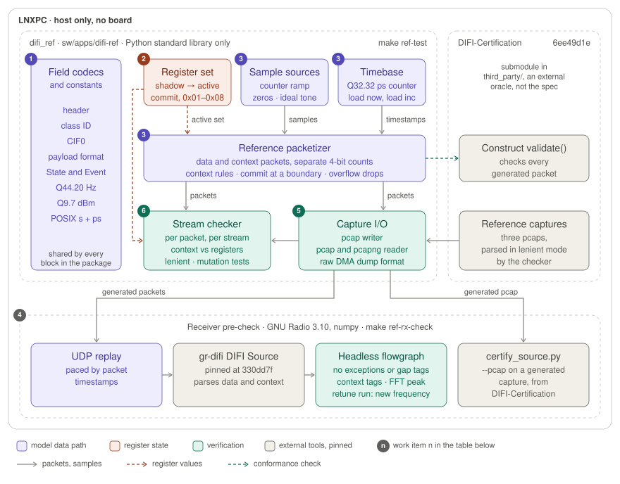
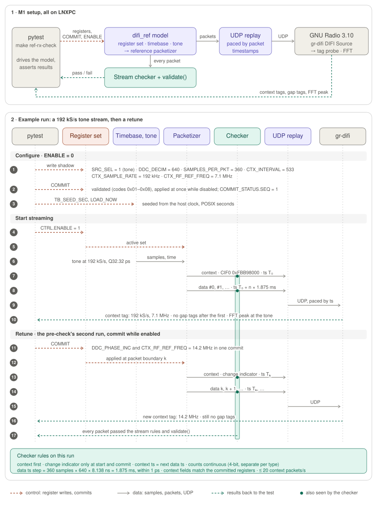
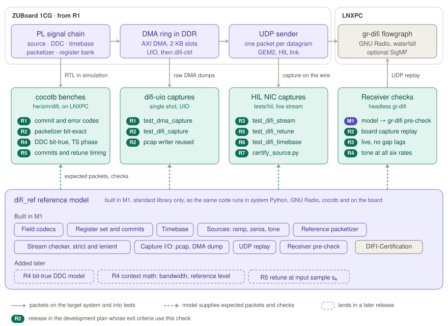

# M1: Reference model and receiver pre-check

Work breakdown for M1 in the [development plan](development_plan.md#m1-reference-model-and-receiver-pre-check-host-only). M1 runs on LNXPC only and needs no hardware. It builds the oracle that every later test depends on (cocotb in R1 to R5, HIL from R2) and passes the architecture's pre-RTL gate on receiver strictness.

## Contents

- [Model at a glance](#model-at-a-glance)
  - [Example run](#example-run)
- [Findings before starting](#findings-before-starting)
- [Design choices](#design-choices)
- [Work items](#work-items)
- [Iterations](#iterations)
  - [Stand-ins and the interfaces they keep](#stand-ins-and-the-interfaces-they-keep)
  - [Mutation checks](#mutation-checks)
- [Out of scope](#out-of-scope)
- [Use in later releases](#use-in-later-releases)
- [Exit criteria](#exit-criteria)
- [Open decision](#open-decision)

---

## Model at a glance

Numbered badges are the [work items](#work-items). Solid arrows carry samples and packets, coral dashed arrows carry register values, and the green dashed arrow is the conformance check. Purple nodes are the model's data path, coral its register state, green the verification code, grey the pinned external tools. Everything inside `difi_ref` runs under `make ref-test`; the receiver pre-check needs GNU Radio and runs under `make ref-rx-check`. Both diagrams show M1 complete; the [iterations](#iterations) build it up as a series of working versions.

### Example run

Panel 1 is the pre-check setup. Panel 2 follows one `make ref-rx-check` run step by step, with example values: 640 decimation (192 kS/s), 360 samples per packet, a 7.1 MHz tune and a retune to 14.2 MHz. Coral dashed arrows are register writes and commits, solid arrows are samples and packets, and green dashed arrows are results returned to the test. A dot marks a packet that the checker also sees. Periodic context packets (`CTX_INTERVAL`) are left out for clarity.

## Findings before starting

- **`gr-difi`'s receive checks are narrow.** At commit `330dd7f`, its source block (`lib/difi_source_cpp_impl.cc`) rejects only a context packet that is not 108 B (or 72 B), a payload-format bit depth that differs from its configured depth, and, as a warning, gaps in the data packet count. It does not check class ID, OUI, CIF0 or timestamps. The [field values](difi-streaming-architecture.md#field-values) satisfy all three checks, so the pre-check is expected to pass on the first run. It reads Reference Level from bits 15:0, which agrees with the spec reading in [Oracle caveats](difi-streaming-architecture.md#oracle-caveats).
- **Everything installs from apt on Ubuntu 22.04.** GNU Radio 3.10.1 with `gnuradio-dev`, `pybind11-dev`, `liborc-0.4-dev`, and `python3-construct` (2.10.67), `python3-numpy`, `python3-scapy`, `python3-yaml`. `gr-difi` is built from source, pinned to `330dd7f`. pip is not installed on LNXPC.
- **`certify_source.py` reports, it does not fail.** At `6ee49d1e` it exits 0 even when the capture fails; the verdict is its `Overall Result` line (and `overall_result` in its summary YAML). Data packets that arrive before the first context packet are skipped without being counted, so a test must also compare its compliant counts with the packets generated. It writes its error log, summary and plots into the working directory. Found in iteration 1; `tests/test_certify.py` handles all three.
- **`make release` breaks once the submodule exists.** `git worktree add` does not initialize submodules, so `ci/release.sh` needs `git submodule update --init` in the worktree.

## Design choices

- **The `difi_ref` core uses only the Python standard library.** Construct is needed only by the `validate()` tests and numpy only by the pre-check's FFT. The core then runs unchanged under the system Python, GNU Radio's Python and R1's cocotb environment, and R2's board-side `difi-uio` can reuse its pcap writer.
- **Dependencies come from apt for now.** R1 probably needs a venv, because cocotb is not packaged for 22.04; a standard-library core makes that move trivial.
- **M1's tone is an ideal complex tone at the output rate.** The bit-exact test source and DDC model belong to R4.

## Work items

What M1 contains. The order in which it lands is set by the [iterations](#iterations), not by this table.

| # | Item | Contents | Estimate |
|---|---|---|---|
| 1 | **Skeleton, field codecs, oracle** | Package at `sw/apps/difi-ref/difi_ref/`. Header, class ID, CIF0, payload-format and State/Event constants; Q44.20 Hz and Q9.7 dBm encoders and decoders; POSIX-seconds plus picosecond timestamps. `third_party/DIFI-Certification` submodule at `6ee49d1e` and a `make ref-test` target, so `validate()` checks every packet from the start. | 3–4 h |
| 2 | **Register set and commits** | Reset values, shadow and active register sets, commit validation with error codes `0x01`–`0x08`, and rejection of a locked register changed while enabled. Logical behaviour only; bus access, CDC and snapshots stay with R1. | 2–3 h |
| 3 | **Timebase and packetizer** | Q32.32 ps timebase with `LOAD_NOW` and `LOAD_INC`, rollover at 10¹² ps, and the borrow from integer seconds when `TS_PIPE_DELAY_PS` is subtracted. Data and context packets with separate 4-bit counts. Context on enable, periodic context (`CTX_INTERVAL`), commit at a packet boundary (context first, change indicator set, same timestamp), `FORCE_CONTEXT`, and overflow (whole-packet drops, count continues, context before resume). Sources: counter ramp (keeps counting through drops), zeros, ideal tone. **This item fixes the rules R2's RTL must match**: how the timestamp's picosecond value is rounded and the latch offset `c`. Both are recorded in the architecture document. | 6–8 h |
| 4 | **Receiver pre-check** | UDP replay tool paced by packet timestamps. GNU Radio and `gr-difi` at the pinned commit. A headless flowgraph that checks: no exceptions, no gap tags after the first, context tags with the expected sample rate and RF frequency, an FFT peak at the tone frequency; a second run commits a retune and checks the new frequency. `certify_source.py --pcap` on a generated capture. Target: `make ref-rx-check`. | 4–6 h |
| 5 | **Capture I/O** | pcap and pcapng reader (standard library, VLAN tags handled); pcap writer with synthetic Ethernet, IPv4 and UDP headers; the raw DMA dump format for R1 (2 KB slots, length from the header), defined and documented now. | 3–4 h |
| 6 | **Checker** | Per packet: constants, sizes, CIF0, reserved and Gain words, integer-hertz fields. Per stream: context first; change indicator only on start and commit; each context timestamp equal to the next data timestamp; count continuity; data timestamps stepping by N · D · inc within 1 ps; gaps sized from timestamps; ramp gaps equal to dropped samples; at most 20 context packets per second. Context fields against the committed registers. A **lenient mode** for the reference captures' quirks (change indicator on every context packet, Gain word set, 8- and 12-bit samples, version packets). **Mutation tests**: each corrupted field must be flagged, so the checker itself is tested. | 6–8 h |
| 7 | **Release integration and docs** | `ref-test` in `ci/release.sh`, plus the submodule step; `python3-construct`, `python3-numpy`, `python3-scapy` and `python3-matplotlib` in `setup-host.sh`; a README for `difi-ref`; README tree and architecture updates. | 2–3 h |

**Total: 26–36 h**, against the plan's 25–35 h.

## Iterations

M1 is built as a series of working versions rather than item by item. Each iteration ends with something that runs end to end against an oracle, and later iterations replace a stand-in rather than add a new path. The receiver risk is retired in iteration 2, before the register set, the real timebase or the checker exist.

| # | Working version | Work items | Done when | Estimate |
|---|---|---|---|---|
| 0 | **Setup.** `third_party/DIFI-Certification` submodule at `6ee49d1e`; Python packages from apt, listed in `setup-host.sh`; package skeleton at `sw/apps/difi-ref/`; `make ref-test`. | 1, 7 (parts) | `make ref-test` runs smoke tests: the oracle is at the pinned commit, and its `validate()` rejects a malformed packet of each type | 1–2 h |
| 1 | **Walking skeleton.** A fixed stream configuration; context packets built from it (on start and periodic, no commits); data packets of an ideal tone; ideal timestamps; pcap writer. | 1, 3, 5 (parts) | Every generated packet passes `validate()`, and a generated pcap passes `certify_source.py --pcap` | 4–5 h |
| 2 | **Receiver.** GNU Radio and `gr-difi` at `330dd7f`; UDP replay paced by timestamps; headless flowgraph; `make ref-rx-check`. | 4, without the retune | `gr-difi` accepts the stream without errors, its context tag carries the configured sample rate and RF frequency, and the FFT peak is at the tone | 4–6 h |
| 3 | **Stream checker, first cut.** Context first, change-indicator placement, count continuity, timestamp step, each context timestamp equal to the next data timestamp, with mutation tests for each; counter-ramp source; pcap and pcapng reader; lenient mode for the reference captures. | 3, 5, 6 (parts) | The checker passes the generated stream, flags every mutation, and parses the three reference captures | 5–7 h |
| 4 | **Register set and commits.** The register set and commit validation replace the fixed configuration; commit at a packet boundary; `FORCE_CONTEXT`; context fields checked against the committed registers. | 2; 3, 6 (parts) | Every commit error code is provoked, and the pre-check's second run sees the retune as a context tag | 3–4 h |
| 5 | **Timebase and overflow.** Q32.32 timebase with `LOAD_NOW`, `LOAD_INC` and rollover; `TS_PIPE_DELAY_PS` and its borrow from integer seconds; overflow drops and resume; zeros source. The picosecond rounding rule and the latch offset `c` go into the architecture document. | 3, 6 (rest) | The checker passes streams across a seconds rollover, through overflow, and with a non-zero pipeline delay; R2's timestamp rules are recorded | 5–7 h |
| 6 | **Finish.** VLAN tags; raw DMA dump format; `ref-test` in `make release` with the submodule step; README for `difi-ref`; architecture updates. | 5, 7 (rest) | The [exit criteria](#exit-criteria) | 3–4 h |

The total, 25–35 h, is about the same as the work items' total. Iterations 4 and 5 replace a stand-in behind an interface that iteration 1 already defines, so little is rewritten.

### Stand-ins and the interfaces they keep

Iteration 1 simplifies three things. Each sits behind the interface its replacement uses, so the packet code does not change when the stand-in goes.

| Stand-in in iteration 1 | Interface | Replaced in |
|---|---|---|
| A frozen configuration with the values of the [example run](#example-run): stream ID 0, decimation 640 (192 kS/s), 360 samples per packet, 7.1 MHz, a context packet about once per second | The packetizer reads its settings only from this object | 4: the active register set |
| Ideal timestamps: T₀ plus n · `DDC_DECIM` / `FS_IN_HZ`, in integer picoseconds | `timestamp(n)` returns (seconds, picoseconds) for output sample n | 5: the Q32.32 timebase |
| An ideal complex tone, its phase taken from the global sample index | A source returns int16 I/Q for a range of sample indices | 3: counter ramp; 5: zeros |

Even iteration 1 follows the stream rules that need no registers: the first packet is a context packet with the change indicator set; each context packet carries the timestamp of the data packet that follows it; data and context packets keep separate 4-bit counts; periodic context packets have the change indicator clear. Field values come from the encoders (Q44.20 Hz, Q9.7 dBm), not from hand-written bytes.

Two pitfalls are avoided from the start:

- **No floating point in timestamps.** A POSIX time in picoseconds is about 1.8 · 10²¹, beyond the 53-bit mantissa of a double, so timestamps use integer arithmetic throughout. With 360 samples per packet, the packet period is a whole number of picoseconds at every main rate (`DDC_DECIM` × 2,929,687.5 ps, and every main decimation is even), so the ideal timestamps of packet starts involve no rounding. Single samples do not fall on whole picoseconds (`DDC_DECIM` × 8,138.02… ps), which is why the real timebase needs a rounding rule in iteration 5.
- **A tone on an FFT bin, below full scale.** For example, +12 kHz at 192 kS/s falls exactly on bin 256 of a 4096-point FFT. With an amplitude of about −6 dBFS before rounding to int16, the FFT check can only fail for reasons that matter.

### Mutation checks

A test suite that passes on its first run proves little until it has been seen to fail. At the end of iteration 1, the model was broken on purpose, one fault at a time, to confirm that `make ref-test` catches each fault and names it.

These are manual checks of the tests, not part of the suite. They differ from the checker's mutation tests (work item 6, iteration 3), which corrupt packets fed to the checker and run in every `make ref-test`.

**Method.** Copy `sw/apps/difi-ref/difi_ref/` aside. Then for each mutant:

1. Apply a one-line edit to the model.
2. Run the suite.
3. Record which tests fail.
4. Restore the file from the copy.

Finish with `diff -r` against the copy, to confirm the model is back to the original. A mutant must change the generated output; an edit that changes nothing proves nothing (one of the first round's edits did exactly that and was replaced).

**Results at iteration 1.** Every mutant was caught, each run took under 5 s, and the failing tests point at the fault:

| Mutant | Edit | Failing tests | Seen by the oracle? |
|---|---|---|---|
| No change indicator on the first context packet | `packetizer.py`: first context with `changed` false | `test_context_first_with_change_indicator`, `test_periodic_context_without_change_indicator` | No |
| Context timestamp one packet late | `packetizer.py`: context packet stamped with the following packet's time | `test_context_carries_next_data_timestamp` | No |
| One count for both packet types | `packetizer.py`: data count also advances on each context packet | `test_counts_continuous_per_type`, `test_generated_capture_passes` | `certify_source.py` only |
| Little-endian payload | `packetizer.py`: no byte swap | `test_payload_is_big_endian_i_then_q` | No |
| I and Q swapped | `sources.py`: I from the sine | `test_peak_on_its_bin_and_clean` (both signs), `test_phase_from_global_index` | No |
| Reference Level in bits 31:16 | `fields.py`: Q9.7 value shifted up 16 bits | `test_ref_level` (4 cases), `test_ref_level_round_trip_and_range`, `test_words_the_oracle_reads_differently` | No; the oracle reads that half itself (see [Oracle caveats](difi-streaming-architecture.md#oracle-caveats)) |
| Floating-point timestamps | `timebase.py`: `int(n · D / fs · 10¹²)` | `test_data_timestamps_step_by_packet_period` | No |
| Wrong OUI | `fields.py`: `0x6A621F` | `test_every_packet_passes_validate`, `test_generated_capture_passes`, `test_class_id`, `test_header_and_class_words` | Yes |
| Every timestamp one second late | `timebase.py`: seed + 1 | `test_data_timestamps_step_by_packet_period` and the timebase tests (11 in all) | No |
| Tone phase restarting each packet | `sources.py`: phase from the in-packet index | `test_continuous_across_packets`, `test_phase_from_global_index` | No |

Only two of the ten faults are visible to the DIFI-Certification tools. The model's own tests carry the rest, which is why the stream checker in iteration 3 has to cover them too.

**What the checks found in the tests themselves.**

- **pytest 6 stalls on long failing comparisons.** A failed `assert` on two 1,100-element lists made pytest diff them with `difflib` for 252 s before failing with a `RecursionError`, so a regression would have looked like a hang. Long sequences are now compared with `assert_same` in `tests/conftest.py`, which reports only the first difference.
- **A test line that could not fail.** One check compared a call's result with the same call. It was replaced with a real continuity check at sample index 10¹².

**Next time.** Repeat these checks at the end of each iteration for the code that iteration adds: the checker in 3, commits in 4, the timebase and overflow in 5. Keep the table above current.

## Out of scope

- Bit-exact test source and DDC model; the context math for bandwidth and reference level (R4).
- Retune timing at input sample s_k (R5). M1's commits switch at output packet boundaries.
- The rate-steering loop (R6).
- Register-bank bus and CDC behaviour (R1).

Until R4, the checker verifies sample rate and RF reference frequency against the registers they derive from, and bandwidth and reference level only against the values written to their context registers.

## Use in later releases

The top row is the target system from the [architecture](difi-streaming-architecture.md#system-overview). Each green box is one way a later release taps into it, and lists the [development plan](development_plan.md#releases) exit criteria that rely on `difi_ref`. Dashed chips are model extensions that land with the release named on them.

## Exit criteria

The plan's criteria, made testable:

- `make ref-test` passes and runs in `make release`.
- Every generated packet passes `validate()`, and a generated pcap passes `certify_source.py --difi-version 1.2.1`.
- The checker parses all three reference captures in lenient mode, and every mutation test is detected.
- `make ref-rx-check` passes: `gr-difi` raises no errors, the tone appears at the expected frequency, and a retune appears as a context tag.

## Open decision

- [ ] **`make ref-rx-check` in `make release`?** It adds GNU Radio (about 1 GB) to the release host's requirements. Proposed: a separate target in M1, part of the release gate from R2, when replaying board captures into `gr-difi` becomes a release demo anyway.
