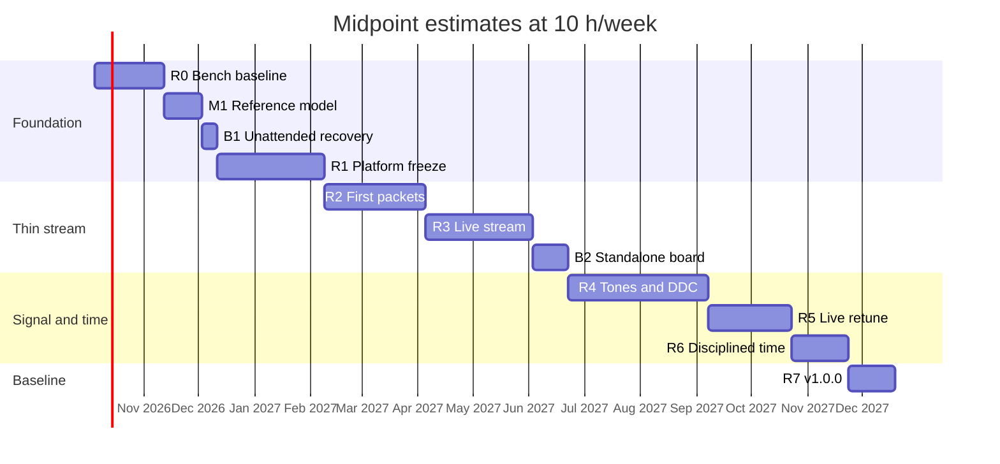
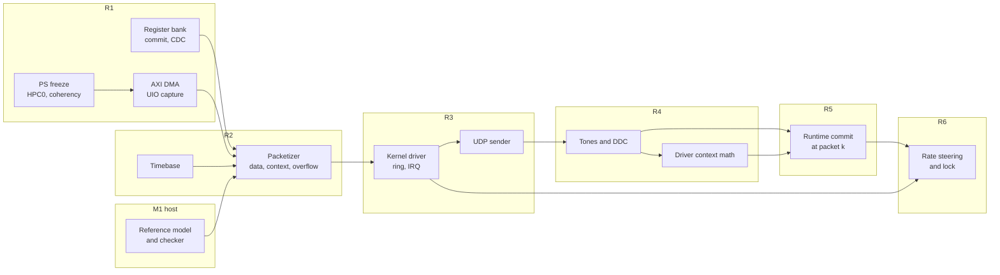

# Development plan

Release plan for the DIFI streaming baseline in [`difi-streaming-architecture.md`](difi-streaming-architecture.md), from the current bench state (`edf-2026_1-followups.md`, rev D) to v1.0.0. Every release runs on the board, passes the HIL suite and is tagged. No release waits for the full feature set.

> **Status:** proposal. Effort figures are estimates for one developer (see [Planning assumptions](#planning-assumptions)). The releases implement the approved architecture and do not change it. Where a release implements only part of a behaviour, [Interim behaviour](#interim-behaviour) says what that build does instead.

---

## Contents

- [Approach](#approach)
- [Planning assumptions](#planning-assumptions)
- [Release overview](#release-overview)
- [Releases](#releases)
- [Interim behaviour](#interim-behaviour)
- [Parallel tracks](#parallel-tracks)
- [Release process](#release-process)
- [Schedule risks](#schedule-risks)
- [Deferred](#deferred)
- [Open decisions](#open-decisions)

---

## Approach

The architecture contains one tangle of dependencies that would otherwise force a big-bang first release. The packetizer needs the register bank, the timebase and a sample source. Seeing its output needs the DMA ring, a driver and the UDP sender. GNU Radio needs valid context packets. Runtime retunes need all of that plus the DDC. Five rules break the tangle:

1. **Release machinery first.** R0 finishes CI, HIL automation and release packaging on the design that already works (AXI IIC and temperature sensor), before any DIFI RTL. From then on, every increment is shippable by construction.
2. **Freeze the PS once.** Every PS configuration change the baseline needs (`S_AXI_HPC0`, its coherency settings, the PS side of MIO34 ownership) lands in one release, R1. After that, per [What rebuilds when](../README.md#what-rebuilds-when), each DIFI release is a PL package, an overlay or software. `platform/` stays unchanged, Stage 2 stays incremental, and HIL keeps exercising the same PS configuration.
3. **Thin end-to-end path before breadth.** The first stream uses the counter ramp, which bypasses the DDC, and settings that change only while disabled. It reaches GNU Radio (R3) before the DDC (R4), runtime commits (R5) and time discipline (R6) are added, so each of those lands on a path that is already tested end to end.
4. **Let the register map carry the staging.** `CAPS`, the `SRC_SEL` rejection (`0x05`), the locked-register rejection (`0x03`) and the State and Event lock indicator already let a build report what it lacks. Interim builds use these mechanisms instead of interim-only registers. Every packet an interim release emits is therefore valid DIFI and truthful: unsteered time, for example, is reported as not locked. The `VERSION` minor number tells the driver which baseline behaviour the PL implements.
5. **One hard problem per release.** Coherent DMA (R1), bit-exact packetizing (R2), the kernel ring (R3), the DSP chain (R4) and signal-aligned commits (R5) each get a release of their own, so a slip in one does not hold the others hostage.

HIL tests accumulate: every release runs all earlier tests as regression.

---

## Planning assumptions

- One developer at about **10 focused hours per week**. Calendar figures scale linearly with that rate; at 5 h/week, double them.
- Effort ranges include simulation, HIL tests and documentation for the release, and assume the bench and toolchain keep working as at rev D of the follow-ups. Vivado and Yocto build time is not counted; interleaving hardware-free work during builds is how that time gets used (see [Parallel tracks](#parallel-tracks)).
- Start: week of 5 October 2026.
- **LNXPC is the runner host and hosts the HIL bench.** R3's interoperability tests (headless `gr-difi`, capture on the HIL NIC) and every demo run there.
- Releases are cut when their exit criteria pass, not on a date. The calendar is for planning only.

---

## Release overview

| Release | Tag | Theme | What you can do with it |
|---|---|---|---|
| R0 | v0.1.0 | Bench baseline | Boot a tagged, HIL-tested image; the PL loads at boot; read the temperature sensor |
| M1 | none (host only) | Reference model | Generate DIFI packets on LNXPC that `gr-difi` accepts |
| R1 | v0.2.0 | Platform freeze and register bank | Talk to the DIFI register bank on hardware; capture coherent DMA frames |
| R2 | v0.3.0 | First packets | Capture bit-exact DIFI packets (ramp) on the board and replay them into GNU Radio |
| R3 | v0.4.0 | Live stream | Stream DIFI continuously from the board into `gr-difi` over UDP |
| R4 | v0.5.0 | Tones and DDC | See a tunable two-tone signal in a GNU Radio waterfall at all six main rates |
| R5 | v0.6.0 | Live retune | Retune while streaming, announced by context packets |
| R6 | v0.7.0 | Disciplined time | Timestamps within milliseconds of NTP, with calibrated-time lock reported |
| R7 | v1.0.0 | Baseline complete | Certified captures, SD-card release, 24 h soak |

Board-track items B1 and B2 (see [Parallel tracks](#parallel-tracks)) are scheduled between releases and ship with the release that follows them.

### Schedule

| Step | Effort (h) | Cumulative (h) | Done after (weeks) | Calendar at 10 h/week | Rebuild |
|---|---|---|---|---|---|
| R0 Bench baseline | 45–65 | 45–65 | 5–7 | Nov 2026 | PL package and rootfs (no PS change) |
| M1 Reference model | 25–35 | 70–100 | 7–10 | Nov–Dec 2026 | None (host only) |
| B1 Unattended recovery | 8–14 | 78–114 | 8–11 | Nov–Dec 2026 | None (bench) |
| R1 Platform freeze | 70–100 | 148–214 | 15–21 | Jan–Mar 2027 | **Full, including BOOT.BIN** |
| R2 First packets | 65–95 | 213–309 | 21–31 | Mar–May 2027 | PL package and apps |
| R3 Live stream (bench-only) | 70–100 | 283–409 | 28–41 | Apr–Jul 2027 | Overlay and software (bitstream unchanged) |
| B2 Standalone board | 20–35 | 303–444 | 30–44 | May–Aug 2027 | BOOT.BIN (PMUFW only) and BSP |
| R4 Tones and DDC | 90–130 | 393–574 | 39–57 | Jul–Nov 2027 | PL package and driver |
| R5 Live retune | 50–80 | 443–654 | 44–65 | Aug 2027–Jan 2028 | PL package and driver |
| R6 Disciplined time | 35–55 | 478–709 | 48–71 | Sep 2027–Feb 2028 | Driver and image only |
| R7 Baseline complete | 30–45 | 508–754 | 51–75 | Sep 2027–Mar 2028 | FIFO sizing, docs |

The Rebuild column shows rule 2 at work: after R1, no release touches the PS configuration.

### Timeline (midpoint estimates)

The bars are serial because one person does the work. Hardware-free work (M1, the DDC and its model, the R5 testbenches) can be pulled forward into build waits; that shortens later bars by the same hours it adds to earlier ones.

### Dependencies

An arrow means "must exist before the next item can be tested on hardware".

---

## Releases

### R0: Bench baseline (v0.1.0)

**Goal.** Turn the working manual bench into an automated, tagged release, so every later increment ships through the same pipeline.

**Scope.**

- **Close out rev D.** Commit the AXI IIC interrupt change, `tests/hil/scripts/` and the `hil-stage` / `jtag-boot` targets. Rebuild the PL package from a clean tree, so the stem loses `-dirty`.
- **PL package in the rootfs.** A recipe in `meta-<project>` installs `<stem>.bit.bin` and `<stem>.dtbo` under `/lib/firmware/`. A boot-time loader (systemd unit or `dfx-mgr`) applies the default overlay and keeps it loaded, because the PL clock stops when it is removed.
- **Overlay fragment mechanism.** Project-owned `.dtso` fragments are merged into Lopper's `pl.dtso` at the overlay step. First user: the STTS22H child node at 0x3f. Later users: `generic-uio` bindings and `dma-coherent` (R1), the driver's compatible string (R3). The overlay step must be able to re-run against a stored XSA without Vivado, so that an overlay-only release (R3) skips Stage 1's Vivado build.
- **Automation login.** Test-only credentials or an SSH key, seeded by `stage-netboot.sh` so that `make hil-stage` no longer resets them.
- **labgrid and `make hil`.** JTAG boot through `jtag-boot.tcl`, console on UART0, reset with `rst -system`.
- **HIL tests.** `test_boot`; `test_pl_load` and `test_pl_regs` as specified in the follow-ups, section 3 (AXI IIC `SR` reads `0xC0`, sensor WHOAMI `0xA0`, temperature in a sane range).
- **GitLab CI.** The thin `.gitlab-ci.yml` from the README, one runner with a shell executor carrying all three tags, `resource_group: zuboard`. Vivado installed on the runner host is fine for now (see [Deferred](#deferred)).
- **Release packaging.** A tag job that collects BOOT.BIN, WIC, kernel, DTB, rootfs, PL package, SDK, `manifest.txt`, `layers.lock.yml`, `SHA256SUMS` and the HIL reports into `/srv/ci-artifacts/<tag>/`, and a release-notes template (see [Release process](#release-process)).
- **Housekeeping.** The follow-ups section 4 items that touch what R0 ships: README layout and CI sections, Makefile `help` and `.PHONY`.

**Exit criteria.** A `v0.1.0` tag pipeline runs all three stages unattended and passes. `test_pl_load` and `test_pl_regs` pass after a boot that uses the recipe-installed loader, without `WITH_PL=1` staging.

**Not in this release.** Any PS change; SD-card boot (B2).

### M1: Reference model and receiver pre-check (host only)

**Goal.** Build the oracle every later test depends on, and pass the architecture's pre-RTL gate on receiver strictness.

**Scope.**

- `sw/apps/difi-ref/`: Python reference packetizer (data and context packets from register values and input samples, with change indicator and timestamps), packet checker (context rules, count continuity, timestamp monotonicity, context fields derived from the committed registers), capture reader (pcap and raw DMA dumps) and a UDP replay tool.
- `third_party/DIFI-Certification` submodule at `6ee49d1e`. Every generated packet passes the Construct `validate()` functions, and the checker parses the three reference captures.
- Receiver pre-check on LNXPC: a headless `gr-difi` flowgraph fed by the reference model over UDP.
- A host-only CI job that runs the `difi-ref` tests on every change.

**Exit criteria.** The pre-check passes: `gr-difi` accepts the packets without errors and produces a tone at the expected frequency. If it rejects anything, settle it here, before RTL.

### R1: Platform freeze and register bank (v0.2.0)

**Goal.** Make the only PS configuration change the baseline needs, and prove the control plane and the coherent DMA path on hardware before any packet logic exists.

**Scope.**

- **PS changes, one `platform/` diff.** Enable `S_AXI_HPC0` at its final width. Add whatever PS-side setup coherency needs _(verify against UG1085: `AWCACHE`, snoop enable, `dma-coherent`)_. Decide MIO34 ownership (follow-ups section 6, item 1); if the decision changes the PS configuration, that change goes here. Review and commit the diff; full rebuild including BOOT.BIN.
- **Block design.** MMCM for `FS_IN` from `pl_clk0`; AXI DMA (S2MM, scatter-gather) on `S_AXI_HPC0`; register bank on the HPM port; DIFI and DMA interrupts concatenated onto `pl_ps_irq0` next to `axi_iic_0`.
- **Register bank RTL.** Full decode of the map: every offset, reserved and growth bits as specified, shadow set, commit handshake and validation with all error codes, snapshot handshake, control-pulse and event-pulse synchronizers, `STICKY` / `IRQ_ENABLE` / IRQ output, counters. That is four of the five synchronizers; the timebase-load handshake comes with the timebase in R2. cocotb tests include the CDC tests under randomized clock ratios. `VERSION` 1.0.0: the map is frozen from this tag, as the architecture specifies.
- **Stub datapath.** The real counter-ramp generator, framed by a throwaway framer (`TLAST` every `SAMPLES_PER_PKT` + 7 words, no prologue), started and stopped by `CTRL.ENABLE`. It exists only to feed the DMA; R2 replaces the framer with the packetizer.
- **Userspace bring-up.** `generic-uio` bindings for the register bank and the DMA via overlay fragments. A recipe for `u-dma-buf` (ikwzm's out-of-tree module; mainline `CONFIG_UDMABUF` is unrelated). A board-side Python tool, `sw/apps/difi-uio/`, that runs the initialization sequence without the timebase seed and does single-shot S2MM captures into the buffer.

**Exit criteria.**

- `test_pl_regs` moves to the DIFI bank: `ID` = `0x4449_4649`, `VERSION` major matches the tool, `SCRATCH` reads back, `CAPS`, `DECIM_RANGE` and `FS_IN_HZ` read their build values.
- `test_difi_commit`: each error code is provoked and reported. `0x03` is provoked by changing `STREAM_ID` while the stub runs. `COMMIT_DONE` raises the interrupt through UIO.
- `test_dma_capture`: 1000 frames captured into a cached `u-dma-buf` mapping without explicit cache maintenance, each matching the ramp. This is the coherency check.
- All R0 tests pass on the new BOOT.BIN.

**Risk.** Coherency is the architecture's largest open _(verify)_. A PS-side setting discovered after R1 would break the freeze, so settle it here even if that stretches R1. If the PL side misbehaves, a non-coherent mapping with explicit sync in `difi-uio` keeps R2 moving, and the item carries into R3.

### R2: First packets (v0.3.0)

**Goal.** Bit-exact DIFI packets from the PL, verified on hardware against the reference model.

**Scope.**

- **Timebase.** Q32.32 picosecond counter in the `FS_IN` domain, `LOAD_NOW`, `LOAD_INC` (the PL half of rate steering; the driver half is R6), `TB_NOW` snapshot, and the timebase-load handshake.
- **Packetizer.** Data and context packets as specified; whole-packet admission (a packet starts only when the FIFO has room for all of it); overflow handling (whole-packet drops, continuing packet count, context before resume, counters); context on `ENABLE`; periodic context via `CTX_INTERVAL`; `FORCE_CONTEXT`; `TS_PIPE_DELAY_PS` subtraction (0 on hardware in this release, non-zero in simulation). `VERSION` 1.1.0.
- **Ramp pacing.** A stand-in for the DDC's output valid strobe, one pulse per `DDC_DECIM` input clocks, so the ramp runs at the real output rates and the context sample rate is correct. R4 replaces it with the DDC.
- **Software.** `difi-uio` runs the full initialization sequence, including the timebase seed from the Linux clock, and writes captures as pcap for the M1 tools.
- **Bench.** The runner serves NTP on the HIL link (chrony, `192.168.77.0/24`), so the board's clock, and therefore the seed, is real.

**Exit criteria.**

- cocotb: packetizer bit-exact against the reference model; context rules; overflow; timebase load. Every simulated packet passes `validate()`.
- `test_difi_capture`: a single-shot capture of 1000 packets at each of the six main decimations passes the checker. Context comes first with the change indicator set; counts are continuous; consecutive data timestamps differ by exactly `SAMPLES_PER_PKT` × `DDC_DECIM` timebase increments, to within 1 ps; context fields match the committed registers. Once the descriptor chain ends, the stalled DMA overflows the FIFO; after re-arming, the ramp gaps equal `CNT_DROPPED_SAMPLES` and a context packet precedes the resumed data. Captures reach the runner through the NFS root.
- Demo: a board capture replayed from LNXPC into `gr-difi` shows the ramp.

**Not in this release.** Continuous streaming, tones, runtime commits. Every commit that changes a setting while running is rejected with `0x03`.

### R3: Live stream (v0.4.0)

**Goal.** A continuous DIFI stream from the board into GNU Radio: the first release that works as a DIFI source.

**Scope.**

- **Kernel driver** `difi-ctrl` (`recipes-kernel/difi-ctrl/`): register bank, DMA through dmaengine, interrupt, character device (`ioctl` for configuration, `mmap` for the ring and status page, `poll` for completions), ring ownership as specified, and a `remove` path that stops the stream and releases the ring before the overlay goes. Initialization and shutdown follow the architecture's sequences. An overlay fragment moves the bank from `generic-uio` to the driver; the bitstream does not change.
- **UDP sender** (`sw/apps/difi-sender/`): `sendmmsg`, length check against the header size field, ring high-water mark, systemd unit, `/etc/difi-sender.conf`.
- **Runner.** GNU Radio and `gr-difi` installed, `net.core.rmem_max` raised, capture permission on the HIL NIC for CI jobs.
- `difi-uio` stays as a debug tool for use with the driver unbound.

**Exit criteria.**

- `test_difi_stream` as specified in the architecture: ramp source, capture on the runner's HIL NIC, every packet checked against the reference model, gaps matching `CNT_DROPPED_SAMPLES`.
- Interoperability, ramp form: headless `gr-difi` on the runner, no missed-packet tags over 10 minutes at 1.92 MS/s; sender length-mismatch count 0.
- Overlay removal while streaming, three cycles: no oops, ring released, stream restarts after reload.
- One hour at 1.92 MS/s with `CNT_OVERFLOW_EVENTS` = 0; ring and FIFO high-water marks recorded.

**Not in this release.** Standalone operation: R3 is bench-only. It boots over JTAG and netboot, uses the fixed fallback `ethaddr` (`HIL_BOARD_MAC`) and is watched from LNXPC over the HIL link. SD boot, EEPROM MAC and clean power-off arrive with B2 before R4. Release notes state this.

**Risk.** The driver is the largest single software item. Check early that `xilinx_dma` reports the transferred length of a short, `TLAST`-terminated S2MM descriptor in its completion residue, because the sender's length check relies on it _(verify)_.

### R4: Tones and DDC (v0.5.0)

**Goal.** The real signal chain: tones in, complex baseband out, with correct timestamps and context.

**Scope.**

- **RTL.** Two-tone test source with saturation, and zeros; DDC with phase-continuous mixer NCO, five-stage CIC (R 16 to 640), fixed ÷4 compensating FIR, `DDC_SHIFT` and clip detection (`STICKY.DDC_CLIP`, `CNT_CLIP_EVENTS`). The ramp is now paced by the DDC's output valid. `CAPS[0]` = 1; `SRC_SEL` 1 and 3 are accepted. `VERSION` 1.2.0.
- **Bit-true Python model** of the DDC in `difi-ref`.
- **Driver.** Decimation and tuning checks, NCO increments, context values (`CTX_SAMPLE_RATE`, `CTX_BANDWIDTH`, `CTX_RF_REF_FREQ`, `CTX_REF_LEVEL` with the residual CIC gain), `DDC_SHIFT` per decimation, `TS_PIPE_DELAY_PS` per decimation and source.
- Settings still change only while disabled: a retune is stop, commit, start.

**Exit criteria.**

- cocotb: DDC bit-true against the model; the timestamp phase test for each main decimation, which checks `TS_PIPE_DELAY_PS`.
- Interoperability, full form: a tone at the expected frequency in `gr-difi` at each of the six main rates. Two full-scale tones raise `DDC_CLIP`. The checker verifies every context field against the committed registers.

**Risk.** Timing closure at 122.88 MHz on the -1 part, with CIC registers of about 16 + 47 bits: budget time for pipelining. BRAM for the FIR and the PL FIFO is limited on the ZU1. The DDC and its model need no hardware, so they are the best candidates for build-wait work during R2 and R3.

### R5: Live retune (v0.6.0)

**Goal.** Runtime commits exactly as specified: aligned to the signal, announced and tear-free.

**Scope.**

- **RTL.** A commit targets packet k, the first packet whose input-side start s_k is still ahead of the pipeline. The NCOs switch at s_k with continuous phase; output-side settings switch when packet k reaches the packetizer; a context packet with the change indicator and packet k's timestamp precedes it. Rejection while enabled is narrowed to the **L** registers. `VERSION` 1.3.0.
- **Driver.** A retune `ioctl` that writes `DDC_PHASE_INC` with `CTX_RF_REF_FREQ` (and `DDC_SHIFT` with `CTX_REF_LEVEL`) in one commit, waits for `COMMIT_DONE`, and keeps commits at least 100 ms apart.

**Exit criteria.**

- cocotb: commit semantics, retune timing, context rules with commits, rejection codes while enabled.
- `test_difi_retune` as specified in the architecture. A burst of 20 commits stays within 20 context packets per second.

### R6: Disciplined time (v0.7.0)

**Goal.** Timestamps that track true time, with an honest lock indicator.

**Scope (driver and image only; no PL change).**

- Rate steering: about once per second, snapshot `TB_NOW` bracketed by the system clock, and adjust `TB_INC_PS_FRAC` through `LOAD_INC` with a PI loop.
- Calibrated-time lock with the specified hysteresis. Each change is committed through `CTX_STATE_EVENT`, using R5's runtime commit. A re-seed drops lock and updates `CTX_TS_CAL_TIME`.
- chrony in the image: the runner as the server on the bench, configurable for LNXPC or internet servers when standalone.

**Exit criteria.** `test_difi_timebase` as specified (one hour within a few milliseconds of the runner's NTP clock; lock asserts after convergence). A forced re-seed drops lock, announced by a context packet with the change indicator set.

**Decide.** How the driver learns chrony's synchronization state: the kernel's `STA_UNSYNC` flag, if chrony maintains it on this image, or a small userspace helper that reports it through an `ioctl` _(verify)_.

### R7: Baseline complete (v1.0.0)

**Scope.**

- Captures pass `certify_source.py --difi-version 1.2.1` at the pinned commit, as a CI step on the HIL captures.
- 24 h soak at 1.92 MS/s: no overflow events, no missed-packet tags, lock held.
- PL FIFO sized from the measured `FIFO_HIGH_WATER`, BRAM reclaimed.
- SD-card boot of the release WIC verified by hand (automated only once an SD mux exists).
- Documentation: architecture status changed to "as built", with any deviations found in R1 to R6; README deviation entries reduced to the jumbo-frame deviation; a user guide for standalone use (SD card, `/etc/difi-sender.conf`, the GNU Radio flowgraph, SigMF recording).

---

## Interim behaviour

What each build does before a behaviour is fully implemented. Release notes quote the rows that apply.

| Behaviour | Full from | Before that |
|---|---|---|
| Register decode, `SCRATCH`, identification block, commit while disabled, error codes | R1 | Not present (R0 has no DIFI bank) |
| Data and context packets, overflow handling, `FORCE_CONTEXT` | R2 | R1: stub frames with ramp payload and no prologue |
| Timebase: `LOAD_NOW`, `LOAD_INC`, `TB_NOW` snapshot | R2 | R1: registers stored, no effect |
| `SRC_SEL` = 2 (counter ramp) at `FS_IN_HZ` / `DDC_DECIM` | R2 | R1: stub always emits the ramp |
| `SRC_SEL` = 1 (tones) and 3 (zeros); `CAPS[0]` | R4 | Rejected with `0x05`; `CAPS[0]` = 0. The driver selects the ramp. |
| Tone and DDC registers, `DDC_CLIP`, `CNT_CLIP_EVENTS` | R4 | Stored, no effect; clip never reported. `DDC_DECIM` already paces the ramp from R2. |
| Non-zero `TS_PIPE_DELAY_PS` on hardware | R4 | Driver writes 0, correct for the ramp |
| Commit that changes a non-**L** setting while `ENABLE=1` | R5 | Rejected with `0x03`, as if every shadowed register were locked. Retune by stop, commit, start. |
| `CTX_STATE_EVENT` bit 19 (calibrated-time lock) | R6 | Driver writes `0xA0000000`: not locked, which is true while nothing steers the timebase |
| Rate steering | R6 | Timebase free-runs at the oscillator's error (about 90 ms per hour at 25 ppm) |
| Continuous ring, kernel driver, UDP sender | R3 | R1–R2: single-shot captures through UIO |

| Release | Register map `VERSION` |
|---|---|
| R1 | 1.0.0 |
| R2, R3 | 1.1.x |
| R4 | 1.2.x |
| R5, R6, R7 | 1.3.x |

The driver refuses unknown majors, as the architecture specifies, and enables features by minor number: packets from 1.1, tones and DDC from 1.2, runtime commits from 1.3. R3 and R6 leave the bitstream unchanged, so they do not bump the map.

---

## Parallel tracks

### Board track

These items do not depend on the DIFI work but gate how releases can be used. They are scheduled as separate steps and ship with the next release.

| Item | Lands before | Why then | Effort |
|---|---|---|---|
| **B1 Unattended recovery.** INIT strap change (R212/R213; board modification, verify against the schematic first) and a smart plug in the labgrid environment. Verify whether FT2232H-driven `PS_POR_N` / `PS_SRST_N` reset is populated. | R1 | R1 adds the first custom AXI slave and possibly a MIO34 change. Either can leave the board hung or powered off, and CI must recover without a press of SW7. | 8–14 h |
| **B2 Standalone board.** PMUFW flags for MIO34 and the SD and QSPI boot paths (follow-ups section 6, items 2–4); clean power-button shutdown with `test_shutdown`; MAC address from the EEPROM after confirming AT24MAC402 versus 602. | R4 | R3 is bench-only (LNXPC is the runner host, so the stream is watched over the HIL link). R4, with tones on screen, is the first release worth running away from the bench, where it needs SD boot, a stable MAC and a clean power-off. B2 must land before R7. | 20–35 h |
| User LEDs (a "streaming" LED is a cheap status indicator), USB hub | Any time | Not needed by the baseline | Not estimated |

B2 changes BOOT.BIN (PMUFW) but not the PS configuration, so it does not break the freeze.

### Build-wait work

M1, the DDC with its bit-true model, and the cocotb benches for R5 need no hardware. They fit into Vivado and Yocto build waits during earlier releases. Pulling them forward shortens R4 and R5 without changing the total.

---

## Release process

- **Tagging.** Tags `v0.N.0` per release; `v0.N.x` for fixes. A tag pipeline runs all three stages plus the SDK, and a tag is only published if HIL passes.
- **Artifacts.** As collected in R0, kept for tags under `/srv/ci-artifacts/<tag>/`; small artifacts (XSA, PL package, reports) in GitLab without expiry.
- **Release notes.** Implemented architecture sections, the [interim behaviour](#interim-behaviour) rows in effect, register map `VERSION`, known issues and the HIL report.
- **A/B comparison.** Because no release after R1 changes the PS configuration, an older release's PL package and driver can be loaded on a running board with the live PL iteration procedure (follow-ups section 7), which helps when bisecting a regression.

---

## Schedule risks

The effort ranges cover ordinary trouble. Each item below can add weeks on its own.

| Risk | Where | Mitigation |
|---|---|---|
| HPC0 coherency settings | R1 | Settle during the freeze; non-coherent fallback for the PL side only |
| `gr-difi` strictness | M1 | Pre-check before any RTL |
| `xilinx_dma` residue for short S2MM transfers | R3 | Check at the start of R3 |
| CIC timing closure at 122.88 MHz; BRAM budget | R4 | Early out-of-context synthesis of the DDC during build waits |
| Commit alignment to s_k | R5 | Isolated in its own release, simulation first |
| MIO34 behaviour on the SD and QSPI boot paths | B2 | JTAG bench unaffected; SD boot not required until R4 |
| Bench hangs or self power-off | B1 | Scheduled before the first custom AXI slave |

---

## Deferred

- **Vivado container** (README open item). CI works with Vivado on the runner host; containerize when the runner host changes or at the next tool bump.
- **SD mux** for automated SD-boot tests, and **OpenOCD** in place of xsdb.
- **Future features** from the architecture (direct-sampling ADC, PPS alignment, GPS timestamps). Each can be a v1.x release of its own, because the map already reserves their allocations. None needs a PS change, provided the PPS input is a PL pin _(verify pinout)_.

---

## Decisions

Closed on 30 September 2026.

- [x] **Pace:** 10 h/week, as assumed in [Planning assumptions](#planning-assumptions).
- [x] **R3 before R4:** kept. The kernel ring is the riskier integration, and the DDC and its model progress in simulation during R3's build waits. Swapping would show tones about two months sooner, but only as capture and replay, which R2 already demos with the ramp.
- [x] **R3 requires B2:** no. R3 ships bench-only, and B2 moves to after R3 and before R4. B2 changes BOOT.BIN (PMUFW) but not the PS configuration, so the freeze holds. Total effort is unchanged; only the order differs.
- [x] **Runner host:** LNXPC. No manual move to the home LAN is needed to watch the stream.